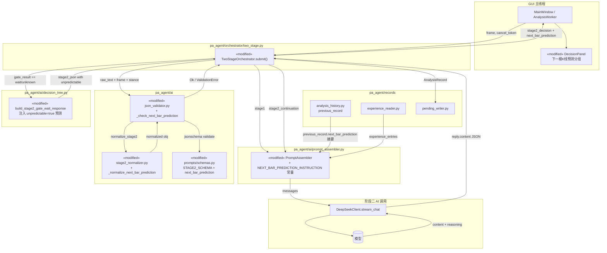
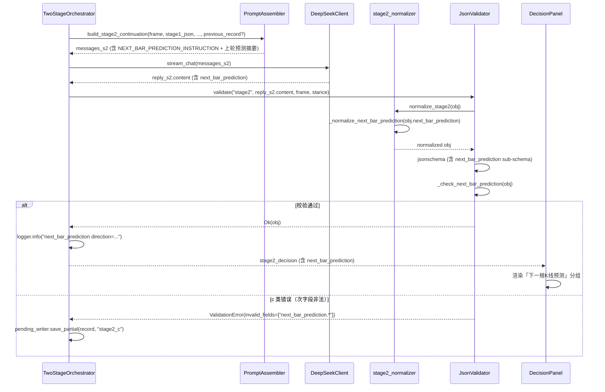
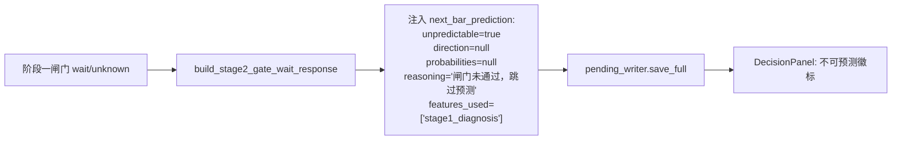

# 设计文档：下一根 K 线方向预测（next-bar-prediction）

## 0. 文档说明

本设计文档基于已批准的 `requirements.md`（同目录），采用 EARS / INCOSE 风格的精确措辞。所有需求引用形如 **R1.3**、**R6.5**、**P3** 等指向需求文档第 3 章 Acceptance Criteria 与第 4 章 Correctness Properties。

绝对路径基准：`D:\cl\PA_Agent\`。代码标识符与 JSON 字段名使用英文，业务措辞使用简体中文。

---

## 1. Overview（概览）

本特性在现有「阶段一诊断 → 阶段二决策」两阶段编排器（`pa_agent/orchestrator/two_stage.py`）之上，**复用同一次阶段二 AI 调用**，让模型在输出交易决策 JSON 时同步追加一个名为 `next_bar_prediction` 的子对象。该对象表达模型对**下一根 K 线**收盘后方向（阳/阴/中性）的概率判断与简体中文理由。

设计原则（来自 R8、R9、R10）：

- **零额外 AI 调用**：预测寄生在阶段二 JSON 中，不引入第三次推理（R4.3）。
- **向后兼容**：`STAGE2_SCHEMA` 通过新增**可选**字段扩展；旧记录加载、回放、演示模式不受影响（R2.2、R2.3、R10.2）。
- **正交于交易决策**：预测**不参与**风险评估、交易者方程或下单字段计算，订单字段语义不变（R1 末段、R8.7）。
- **短路兜底**：阶段一闸门为 `wait/unknown` 时，由 `build_stage2_gate_wait_response`（`pa_agent/ai/decision_tree.py`）合成 `unpredictable=true` 的占位预测（R1.8、R4.6）。
- **GUI 内联呈现**：在 `DecisionPanel`（`pa_agent/gui/decision_panel.py`）「交易决策置信度」与「分析理由」之间新增「下一根K线预测」分组，缺失字段静默隐藏（R6）。

特性边界（参照 `requirements.md` §6）：仅预测**一根**未来 K 线、不做事后准确率回测、不做模型自学习、不在图表上叠加预测箭头。

---

## 2. Architecture（架构）

### 2.1 高层数据流

下图展示了在现有两阶段编排器内嵌入下一根 K 线预测的位置与数据流。**新增 / 改造组件**用 `«new»` / `«modified»` 标注；其余组件保持现状。



### 2.2 关键调用顺序

阶段二一次成功推理的时序如下：



### 2.3 短路路径

当阶段一 `gate_result ∈ {wait, unknown}` 时（R1.8、R4.6）：



短路路径**不**调用模型、**不**经过 `JsonValidator.validate("stage2", ...)`（直接由编排器写入 `record.stage2_decision`），因此不需要 Schema 验证。但 schema 仍需接受这种合法形态（R2.6）。

---

## 3. Components and Interfaces（组件与接口改造点）

本节列出每个被改造模块的**精确改造点**。未列出的模块保持不变（R8.1–R8.5）。

### 3.1 `pa_agent/ai/prompts/schemas.py`：新增 `next_bar_prediction` 子 schema

在文件末尾、`STAGE2_SCHEMA` 定义**之前**新增内部常量：

```python
_NEXT_BAR_PROBABILITIES: dict = {
    "type": ["object", "null"],
    "required": ["bullish", "bearish", "neutral"],
    "properties": {
        "bullish": {"type": "integer", "minimum": 0, "maximum": 100},
        "bearish": {"type": "integer", "minimum": 0, "maximum": 100},
        "neutral": {"type": "integer", "minimum": 0, "maximum": 100},
    },
    "additionalProperties": False,
}

_NEXT_BAR_PREDICTION: dict = {
    "type": "object",
    "required": ["direction", "probabilities", "reasoning", "unpredictable", "features_used"],
    "properties": {
        "direction": {
            "type": ["string", "null"],
            "enum": ["bullish", "bearish", "neutral", None],
        },
        "probabilities": _NEXT_BAR_PROBABILITIES,
        "reasoning": {"type": "string", "minLength": 30, "maxLength": 1500},
        "unpredictable": {"type": "boolean"},
        "features_used": {
            "type": "array",
            "items": {
                "type": "string",
                "enum": [
                    "stage1_diagnosis",
                    "kline_features",
                    "analysis_history",
                    "experience_library",
                    "stage2_decision",
                ],
            },
            "uniqueItems": True,
        },
    },
    "allOf": [
        {
            "if": {
                "properties": {"unpredictable": {"const": False}},
                "required": ["unpredictable"],
            },
            "then": {
                "properties": {
                    "direction": {"type": "string", "enum": ["bullish", "bearish", "neutral"]},
                    "probabilities": {"type": "object"},
                },
            },
        },
        {
            "if": {
                "properties": {"unpredictable": {"const": True}},
                "required": ["unpredictable"],
            },
            "then": {
                "properties": {
                    "direction": {"type": "null"},
                    "probabilities": {"type": "null"},
                },
            },
        },
    ],
    "additionalProperties": False,
}
```

在 `STAGE2_SCHEMA.properties` 中追加：

```python
"next_bar_prediction": _NEXT_BAR_PREDICTION,
```

`STAGE2_SCHEMA.required` **不**追加 `next_bar_prediction`（R2.2）。其他字段不变（R8.1、R8.3）。

### 3.2 `pa_agent/ai/prompt_assembler.py`：新增内联预测说明常量与渲染

#### 3.2.1 模块级常量

紧邻 `_STAGE2_OUTPUT_CONTRACT` 之后新增：

```python
_NEXT_BAR_PREDICTION_INSTRUCTION = """
## 下一根K线预测任务（阶段二附加输出，不影响下单决策）

完成 decision / decision_trace / terminal 后，必须在阶段二 JSON 顶层追加键 `next_bar_prediction`，
表达对下一根（尚未开始或正在形成）K线收盘后的方向预测：

```json
"next_bar_prediction": {
  "direction": "bullish|bearish|neutral",
  "probabilities": {"bullish": 45, "bearish": 35, "neutral": 20},
  "reasoning": "简体中文理由，30–1500 字。须明确引用 §1 阶段一诊断、最近 K 线几何特征、以及（若提供）上一轮预测摘要。",
  "unpredictable": false,
  "features_used": ["stage1_diagnosis", "kline_features"]
}
```

硬约束（违反则整体阶段二 JSON 校验失败）：

1. probabilities 三个值均为 0–100 整数，三者之和必须落在 [99, 101]（容差 ±1，源于取整）。
2. direction 必须等于 probabilities 中数值最大的键；并列最大时取 JSON 出现顺序中靠前的键
   （即按 bullish → bearish → neutral 的字面顺序）。
3. reasoning 长度 30–1500 字，简体中文，不写下单价格、不写止损止盈，仅讨论方向与概率依据。
4. features_used 至少包含 "stage1_diagnosis"；若提示词中提供了对应来源，应同步包含
   "kline_features" / "analysis_history" / "experience_library"。
5. 数据不足（K 线数 < 8）、或阶段一诊断为 extreme_tr / unknown、或市场极端混乱时：
   设 unpredictable=true，direction=null，probabilities=null，reasoning 写明原因。
6. 此预测**不**进入交易者方程、**不**改变 decision 中任意字段，仅作辅助参考。
"""
```

#### 3.2.2 上一轮预测摘要渲染（增量分析）

在 `PromptAssembler` 类内新增静态方法：

```python
@staticmethod
def _render_previous_prediction(previous_record: AnalysisRecord) -> str:
    """渲染上一轮 next_bar_prediction 的简短摘要（仅用于增量分析对比）。"""
    pred = (previous_record.stage2_decision or {}).get("next_bar_prediction")
    if not isinstance(pred, dict):
        return ""
    if pred.get("unpredictable"):
        return "## 上一轮下一根K线预测\n\n上一轮标记为不可预测；本轮请独立判断。\n"
    direction = pred.get("direction") or "—"
    probs = pred.get("probabilities") or {}
    return (
        "## 上一轮下一根K线预测（仅供对比，非约束）\n\n"
        f"- direction: {direction}\n"
        f"- probabilities: 阳 {probs.get('bullish', '—')}% / "
        f"阴 {probs.get('bearish', '—')}% / 中性 {probs.get('neutral', '—')}%\n"
        "- 说明：本轮可与上一轮比较一致性；若结构发生改变，请在 reasoning 中说明翻转理由。\n"
    )
```

#### 3.2.3 追加位置

修改 `_build_stage2_user_prompt`：在 `stage2_parts` 列表中**于 `_STAGE2_OUTPUT_CONTRACT` 之前**追加 `_NEXT_BAR_PREDICTION_INSTRUCTION`，保证模型先看到主决策契约、再看到附加预测契约。

修改 `build_stage2_continuation`：当调用方传入 `previous_record` 且其 `stage2_decision.next_bar_prediction` 存在时，把 `_render_previous_prediction(previous_record)` 拼接到 user 段落末尾、`_STAGE2_TAIL_REMINDER` 之前。`build_stage2_continuation` 签名追加可选参数：

```python
def build_stage2_continuation(
    self,
    *,
    frame: KlineFrame,
    stage1_messages: list[dict],
    stage1_reply_content: str,
    stage1_json: dict,
    strategy_files: list[str],
    experience_entries: list[Any],
    decision_stance: str = "conservative",
    previous_record: AnalysisRecord | None = None,   # NEW，默认 None 保持向后兼容
) -> list[dict]:
```

`TwoStageOrchestrator` 已经持有 `previous_record`（来自 `submit()` 入参），把它直接透传给 `build_stage2_continuation`。

#### 3.2.4 不引入新提示词文件

预测说明仅以模块级常量形式存在（R5.5、NFR4.2）。不修改 `STAGE1_TASK_PROMPT_TXT_FILES`、`STAGE2_BASE_PROMPT_TXT_FILES`、`STAGE2_FULL_STRATEGY_PROMPT_TXT_FILES` 列表。

### 3.3 `pa_agent/ai/stage2_normalizer.py`：新增 `_normalize_next_bar_prediction`

在 `normalize_stage2` 中、`bar_analysis` 归一化之后追加：

```python
def _normalize_next_bar_prediction(prediction: dict[str, Any]) -> None:
    """就地修正 next_bar_prediction 中常见模型偏差，幂等。"""
    if not isinstance(prediction, dict):
        return

    # 1. unpredictable 兜底
    unpredictable = bool(prediction.get("unpredictable", False))
    prediction["unpredictable"] = unpredictable

    # 2. features_used 兜底为有序去重列表，至少包含 stage1_diagnosis
    feats = prediction.get("features_used")
    if not isinstance(feats, list):
        feats = []
    feats = [f for f in feats if isinstance(f, str)]
    if "stage1_diagnosis" not in feats:
        feats.insert(0, "stage1_diagnosis")
    seen: set[str] = set()
    deduped: list[str] = []
    for f in feats:
        if f not in seen:
            deduped.append(f)
            seen.add(f)
    prediction["features_used"] = deduped

    # 3. reasoning 截断（R7.6）
    reasoning = prediction.get("reasoning")
    if isinstance(reasoning, str) and len(reasoning) > 1500:
        prediction["reasoning"] = reasoning[:1499] + "…"
    elif not isinstance(reasoning, str):
        prediction["reasoning"] = ""

    if unpredictable:
        # unpredictable 时强制 direction / probabilities = null
        prediction["direction"] = None
        prediction["probabilities"] = None
        return

    # 4. probabilities 整数化（R3.1）
    probs = prediction.get("probabilities")
    if isinstance(probs, dict):
        normalized: dict[str, int] = {}
        for key in ("bullish", "bearish", "neutral"):
            raw = probs.get(key)
            try:
                value = int(round(float(raw))) if raw is not None else 0
            except (TypeError, ValueError):
                value = 0
            normalized[key] = max(0, min(100, value))
        prediction["probabilities"] = normalized

        # 5. direction = argmax（R3.3，按字面顺序破并列）
        order = ("bullish", "bearish", "neutral")
        max_value = max(normalized[k] for k in order)
        prediction["direction"] = next(k for k in order if normalized[k] == max_value)
    else:
        # 模型给了不可解析的 probabilities 但又声称 unpredictable=False —— 留给校验器报 c 类错
        pass


def normalize_stage2(obj: dict[str, Any]) -> dict[str, Any]:
    out = copy.deepcopy(obj)
    normalize_stage2_traces(out)
    decision = out.get("decision")
    if isinstance(decision, dict) and decision.get("order_type") == "不下单":
        decision["estimated_win_rate"] = None

    bar_analysis = out.get("bar_analysis")
    if isinstance(bar_analysis, dict):
        # ... 既有 signal_bar / entry_bar 归一化逻辑保持不变 ...
        ...

    # NEW：仅当字段存在时调用，与既有逻辑互不影响（R8.6）
    pred = out.get("next_bar_prediction")
    if isinstance(pred, dict):
        _normalize_next_bar_prediction(pred)

    return out
```

要点（对应 R8.6、R8.7、R3.1、R7.6）：

- 归一化函数**仅当 `next_bar_prediction` 存在时**触发，旧记录与缺失字段路径完全不受影响。
- `_normalize_next_bar_prediction` 为**幂等**操作：第二次调用的输入即第一次的输出，所有字段已经规范化（满足 P6）。
- 与 `decision.order_type == "不下单"` 的修正完全正交（R8.7）。

### 3.4 `pa_agent/ai/json_validator.py`：新增 `_check_next_bar_prediction`

在 `JsonValidator` 类内、`_check_signal_chain` 之后新增：

```python
@staticmethod
def _check_next_bar_prediction(obj: dict) -> list[str]:
    """跨字段校验：和约束、direction=argmax、null 一致性。

    返回错误消息列表（空列表表示通过）；调用方会把每条加入 invalid_fields。
    """
    pred = obj.get("next_bar_prediction")
    if pred is None:
        return []  # 缺失即视为旧记录或未来短路兼容（R2.3、R7.3）
    if not isinstance(pred, dict):
        return ["next_bar_prediction: must be an object when present"]

    errors: list[str] = []
    unpredictable = bool(pred.get("unpredictable", False))

    if unpredictable:
        if pred.get("direction") is not None:
            errors.append("next_bar_prediction.direction: must be null when unpredictable=true")
        if pred.get("probabilities") is not None:
            errors.append("next_bar_prediction.probabilities: must be null when unpredictable=true")
        return errors

    # unpredictable=false 路径
    probs = pred.get("probabilities")
    if not isinstance(probs, dict):
        return ["next_bar_prediction.probabilities: must be an object when unpredictable=false"]

    for key in ("bullish", "bearish", "neutral"):
        value = probs.get(key)
        if not isinstance(value, int) or not (0 <= value <= 100):
            errors.append(f"next_bar_prediction.probabilities.{key}: must be int in [0, 100]")
    if errors:
        return errors

    # R3.2：和落在 [99, 101]
    total = probs["bullish"] + probs["bearish"] + probs["neutral"]
    if not (99 <= total <= 101):
        errors.append(
            f"next_bar_prediction.probabilities: sum={total}, must satisfy 99 <= sum <= 101"
        )

    # R3.3：direction = argmax，按字面顺序破并列
    order = ("bullish", "bearish", "neutral")
    max_value = max(probs[k] for k in order)
    expected = next(k for k in order if probs[k] == max_value)
    direction = pred.get("direction")
    if direction != expected:
        errors.append(
            f"next_bar_prediction.direction: expected '{expected}' (argmax of probabilities), "
            f"got {direction!r}"
        )

    return errors
```

在 `validate()` 中、`_check_signal_chain` 调用之后追加：

```python
for msg in self._check_next_bar_prediction(obj):
    invalid.append(msg)
```

错误统一以 `next_bar_prediction.` 前缀进入 `invalid_fields`，满足 R2.4、NFR2.3。

### 3.5 `pa_agent/ai/decision_tree.py`：短路路径注入预测

修改 `build_stage2_gate_wait_response`，在返回字典末尾追加：

```python
return {
    "decision": { ... },
    "diagnosis_summary": { ... },
    "decision_trace": [],
    "terminal": { ... },
    "gate_shortcircuited": True,
    "next_bar_prediction": {
        "direction": None,
        "probabilities": None,
        "reasoning": (
            f"阶段一闸门结论为「{stage1_json.get('gate_result', 'wait')}」（节点 {node_id}），"
            "未进入策略分支评估，亦不预测下一根 K 线方向。"
        ),
        "unpredictable": True,
        "features_used": ["stage1_diagnosis"],
    },
}
```

`reasoning` 长度受 `_normalize_next_bar_prediction` 截断保护（R7.6），但短路路径**不**经过归一化器；因此构造时应保证生成文本 ≤ 1500 字符（实际 ≈ 60 字符，远低于上限）。

`validate_stage2_trace_consistency` **不**修改（R8.2）：当 `gate_shortcircuited=True` 时它直接返回空列表，不检查 `next_bar_prediction`。

### 3.6 `pa_agent/gui/decision_panel.py`：新增「下一根K线预测」分组

#### 3.6.1 模块级常量

在 `_MARKET_PHASE_ZH` 之后新增：

```python
_PREDICTION_DIRECTION_ZH: dict[str, str] = {
    "bullish": "阳线",
    "bearish": "阴线",
    "neutral": "中性",
}

_PREDICTION_DIRECTION_COLOR: dict[str, str] = {
    "bullish": "#3fb950",
    "bearish": "#f85149",
    "neutral": "#e6b800",
}

_PREDICTION_UNPREDICTABLE_COLOR = "#8b949e"
_PREDICTION_UNPREDICTABLE_LABEL = "不可预测"
```

#### 3.6.2 UI 结构

在 `_setup_ui` 中、`self._trade_reasoning_label` 之后、`reasoning_title = QLabel("分析理由")` 之前插入：

```python
# ── 下一根K线预测 ────────────────────────────────────────────────
self._prediction_group = QFrame()
self._prediction_group.setObjectName("predictionGroup")
pred_layout = QVBoxLayout(self._prediction_group)
pred_layout.setContentsMargins(0, 6, 0, 6)
pred_layout.setSpacing(4)

self._prediction_title = QLabel("下一根K线预测")
self._prediction_title.setStyleSheet("font-weight: bold; color: #58a6ff;")
pred_layout.addWidget(self._prediction_title)

self._prediction_direction_label = QLabel("—")
self._prediction_direction_label.setAlignment(Qt.AlignmentFlag.AlignCenter)
self._prediction_direction_label.setStyleSheet(
    "font-size: 16px; font-weight: bold; padding: 6px;"
    "background-color: #21262d; border-radius: 6px; color: #8b949e;"
)
pred_layout.addWidget(self._prediction_direction_label)

self._prediction_probs_label = QLabel("阳 — %　阴 — %　中性 — %")
self._prediction_probs_label.setAlignment(Qt.AlignmentFlag.AlignCenter)
self._prediction_probs_label.setObjectName("mutedLabel")
pred_layout.addWidget(self._prediction_probs_label)

self._prediction_reasoning_edit = QTextEdit()
self._prediction_reasoning_edit.setReadOnly(True)
self._prediction_reasoning_edit.setObjectName("answerPane")
self._prediction_reasoning_edit.setMaximumHeight(120)
pred_layout.addWidget(self._prediction_reasoning_edit)

layout.addWidget(self._prediction_group)
self._prediction_group.setVisible(False)  # 默认隐藏，待 set_decision 时按需显示
```

布局位置满足 R6.1：在「交易决策置信度」（`self._trade_reasoning_label`）之下、「分析理由」（`reasoning_title`）之上。

#### 3.6.3 渲染逻辑

新增 `_apply_next_bar_prediction` 方法，在 `set_decision` 末尾、`self._reasoning_edit.setPlainText(...)` 之前调用：

```python
def _apply_next_bar_prediction(self, decision: dict) -> None:
    """渲染下一根K线预测分组；缺失或非法时静默隐藏（R6.5、R7.3、P8）。"""
    pred = decision.get("next_bar_prediction") if isinstance(decision, dict) else None
    if not isinstance(pred, dict):
        self._prediction_group.setVisible(False)
        self._prediction_reasoning_edit.clear()
        return

    unpredictable = bool(pred.get("unpredictable", False))
    reasoning = str(pred.get("reasoning") or "").strip()

    if unpredictable:
        self._prediction_direction_label.setText(_PREDICTION_UNPREDICTABLE_LABEL)
        self._prediction_direction_label.setStyleSheet(
            f"font-size: 16px; font-weight: bold; padding: 6px;"
            f"background-color: #21262d; border-radius: 6px;"
            f"color: {_PREDICTION_UNPREDICTABLE_COLOR};"
        )
        self._prediction_probs_label.setText("阳 —　阴 —　中性 —")
    else:
        direction = str(pred.get("direction") or "")
        probs = pred.get("probabilities") or {}
        zh = _PREDICTION_DIRECTION_ZH.get(direction, "—")
        color = _PREDICTION_DIRECTION_COLOR.get(direction, _PREDICTION_UNPREDICTABLE_COLOR)
        self._prediction_direction_label.setText(zh)
        self._prediction_direction_label.setStyleSheet(
            f"font-size: 16px; font-weight: bold; padding: 6px;"
            f"background-color: #21262d; border-radius: 6px;"
            f"color: {color};"
        )
        try:
            p_b = int(probs.get("bullish", 0))
            p_s = int(probs.get("bearish", 0))
            p_n = int(probs.get("neutral", 0))
            self._prediction_probs_label.setText(
                f"阳 {p_b}%　阴 {p_s}%　中性 {p_n}%"
            )
        except (TypeError, ValueError):
            self._prediction_probs_label.setText("阳 —　阴 —　中性 —")

    self._prediction_reasoning_edit.setPlainText(reasoning)
    self._prediction_group.setVisible(True)
```

#### 3.6.4 清空逻辑

在 `clear()` 末尾追加：

```python
self._prediction_group.setVisible(False)
self._prediction_direction_label.setText("—")
self._prediction_probs_label.setText("阳 — %　阴 — %　中性 — %")
self._prediction_reasoning_edit.clear()
```

满足 R6.6。

#### 3.6.5 兼容旧记录

`_apply_next_bar_prediction` 入参为 `decision: dict`，演示模式 / 历史回放走的是同一份 `set_decision` 接口（R10.1、R10.2）。`set_decision` 在已有交易决策渲染逻辑之后调用 `_apply_next_bar_prediction(decision)`，因此对所有不含 `next_bar_prediction` 的旧记录该分组始终隐藏，不抛出异常（R6.5、P8）。

### 3.7 `pa_agent/orchestrator/two_stage.py`：阶段二完成后日志输出

在 `submit()` 中、Step 19 (`on_event(OrchestratorEvent.Stage2Done)`) 之后、Step 20 之前追加：

```python
pred = stage2_json.get("next_bar_prediction") if isinstance(stage2_json, dict) else None
if isinstance(pred, dict):
    if pred.get("unpredictable"):
        logger.info("next_bar_prediction direction=null probs=null/null/null unpredictable=true")
    else:
        probs = pred.get("probabilities") or {}
        logger.info(
            "next_bar_prediction direction=%s probs=%s/%s/%s unpredictable=false",
            pred.get("direction"),
            probs.get("bullish"),
            probs.get("bearish"),
            probs.get("neutral"),
        )
```

短路路径（`build_stage2_gate_wait_response`）也应在 `on_event(OrchestratorEvent.Stage2Done)` 之后输出同格式日志。两条 `logger.info` 满足 R9.3、NFR2.1。控制台 `print` 不新增（R9.6）。

`previous_record` 透传：在 `build_stage2_continuation` 调用处把现有 `previous_record` 参数追加到关键字参数：

```python
messages_s2 = self._assembler.build_stage2_continuation(
    frame=frame,
    stage1_messages=messages_s1,
    stage1_reply_content=reply_s1.content,
    stage1_json=stage1_json,
    strategy_files=strategy_files,
    experience_entries=experience_entries,
    decision_stance=record.meta.decision_stance,
    previous_record=previous_record,  # NEW
)
```

---

## 4. Data Models（数据模型与 JSON 扩展）

### 4.1 `next_bar_prediction` 字段定义

| 字段 | 类型 | 取值范围 | 必填 | 说明 |
|------|------|----------|------|------|
| `direction` | string \| null | `"bullish"` / `"bearish"` / `"neutral"` / `null` | 是 | 方向预测；`unpredictable=true` 时必须为 `null`，否则必须为非空枚举且等于 `probabilities` 的 argmax（R3.3） |
| `probabilities` | object \| null | 见 4.1.1 | 是 | 三元概率分布；`unpredictable=true` 时必须为 `null` |
| `probabilities.bullish` | int | 0–100 | 是（当外层非 null） | 阳线概率百分比 |
| `probabilities.bearish` | int | 0–100 | 是 | 阴线概率百分比 |
| `probabilities.neutral` | int | 0–100 | 是 | 中性（平/接近平）概率百分比 |
| `reasoning` | string | 长度 30–1500 | 是 | 简体中文理由；超长由归一化器截断（R7.6） |
| `unpredictable` | boolean | `true` / `false` | 是 | 显式不可预测标记（R7.1、R7.2） |
| `features_used` | string[] | 见 4.1.2 | 是 | 至少包含 `"stage1_diagnosis"`；元素唯一（R5.4） |

#### 4.1.1 `probabilities` 对象约束

- `additionalProperties: false`：禁止任何超出三键的字段。
- 三键值之**和**（`bullish + bearish + neutral`）必须落在 `[99, 101]` 闭区间（R3.2，容差源于整数四舍五入）。
- 任一键值越界（< 0 或 > 100）触发 c 类错误（R3.4）。

#### 4.1.2 `features_used` 枚举

固定枚举集（schema 内 `enum` 限定）：

| 标签 | 触发条件（在提示词中实际写入对应来源时应包含） |
|------|-----------------------------------------------|
| `stage1_diagnosis` | **始终包含**（强制最小集，R5.4） |
| `kline_features` | 阶段二提示词包含「K线几何特征」表（当前总是包含） |
| `analysis_history` | 增量分析路径，提示词包含上一轮预测摘要 |
| `experience_library` | `experience_entries` 非空，提示词包含经验库案例段 |
| `stage2_decision` | 模型在写预测前已经写出 `decision`（语义上预测必须晚于决策） |

`stage2_decision` 是设计扩展点（不强制，但允许），便于 P5 校验。

### 4.2 `STAGE2_SCHEMA` 顶层扩展

仅新增**一个**可选键：

```python
STAGE2_SCHEMA["properties"]["next_bar_prediction"] = _NEXT_BAR_PREDICTION
# STAGE2_SCHEMA["required"] 不追加 next_bar_prediction
```

### 4.3 向后兼容策略

| 历史路径 | 行为 |
|----------|------|
| `record.stage2_decision` 不含 `next_bar_prediction` | Schema 校验通过（R2.3）；`DecisionPanel` 隐藏分组（R6.5、R10.2） |
| `record.stage2_decision.next_bar_prediction = {}`（空对象） | Schema 报 b 类错（缺 required 子字段），按 R7.4 写入 `record.exception` |
| `record.stage2_decision.next_bar_prediction.unpredictable = true` 但 `direction` 非 null | `_check_next_bar_prediction` 返回 c 类错；`invalid_fields` 含 `next_bar_prediction.direction` |
| `record.stage2_decision.next_bar_prediction.probabilities` 之和 = 102 | `_check_next_bar_prediction` 返回 c 类错（超出容差）|
| `record.stage2_decision.next_bar_prediction.reasoning` 超过 1500 字 | 归一化器截断到 1500（R7.6）；schema 校验后续通过 |
| 演示模式回放 `next_bar_prediction` 缺失记录 | `set_decision` 内部 `_apply_next_bar_prediction` 直接隐藏分组（R10.2、P8） |

### 4.4 `AnalysisRecord` 不变

`pa_agent/records/schema.py` 中的 `AnalysisRecord.stage2_decision: Optional[dict]` 字段已经是 `dict`，无需修改 Pydantic 模型；`pending_writer.save_full` 直接序列化整个字典，新字段透传落盘（R9.4、A4）。

---

<!--
=========================================================================
   STOP — 在此处调用 prework 工具，完成对 §3 Acceptance Criteria 的可测性分析
   prework 完成后，再写下方的 Correctness Properties 节。
=========================================================================
-->


## 5. Correctness Properties（正确性属性）

*属性是一种应在系统所有合法执行中都成立的特征或行为——本质上是一个关于「软件应该做什么」的形式化陈述。属性是在人类可读的需求规约与机器可验证的正确性保证之间架起的桥梁。*

下方属性已经过 §4 prework 的去重与合并：从需求文档 §3 的 33 条 Acceptance Criteria 中筛出可 PBT 的部分，合并冗余后得到 10 条核心属性，覆盖归一化、校验、短路、序列化与 GUI 健壮性五个域。每条属性附 `*For all*` 通用量化语句与对应需求引用。

### Property 1：probabilities 数值合法性与和约束

*For any* 通过 schema 校验的 `next_bar_prediction` 对象 `p`，若 `p.unpredictable == False`：每个 `p.probabilities[k]`（`k ∈ {bullish, bearish, neutral}`）都必须是 `0` 至 `100` 之间（含端点）的整数，且三者之和落在 `[99, 101]` 闭区间内。

**Validates: Requirements R1.4, R3.2, R3.4**

### Property 2：direction 等于 probabilities 的 argmax

*For any* 通过 schema 校验的 `next_bar_prediction` 对象 `p`，若 `p.unpredictable == False`：`p.direction` 必须等于 `p.probabilities` 中数值最大的键；当存在并列最大值时，`p.direction` 必须等于按字面顺序 `bullish → bearish → neutral` 中最先出现的并列键。

**Validates: Requirements R3.3**

### Property 3：unpredictable 真假分支与 null 一致性

*For any* 通过 schema 校验的 `next_bar_prediction` 对象 `p`：

- 若 `p.unpredictable == True`，则 `p.direction == None` 且 `p.probabilities == None`；
- 若 `p.unpredictable == False`，则 `p.direction` 是 `bullish/bearish/neutral` 之一且 `p.probabilities` 是含三个整数键的对象。

**Validates: Requirements R2.6, R2.7, R3.5**

### Property 4：reasoning 长度归一化

*For any* 字符串 `s`，把 `s` 写入 `next_bar_prediction.reasoning` 后调用 `_normalize_next_bar_prediction`：归一化后 `reasoning` 长度 `≤ 1500`；若 `len(s) > 1500`，则归一化后字符串以 `"…"` 结尾且总长度恰为 `1500`。

**Validates: Requirements R1.5, R7.6**

### Property 5：features_used 最小集与去重

*For any* 输入 `next_bar_prediction.features_used`（含缺失、空数组、含重复元素、含非字符串元素）：调用 `_normalize_next_bar_prediction` 后 `features_used` 是字符串列表，元素互不重复，且至少包含 `"stage1_diagnosis"`。

**Validates: Requirements R1.7, R5.4**

### Property 6：归一化器幂等且与 order_type 正交

*For any* 阶段二 JSON `s`（含或不含 `next_bar_prediction`，`decision.order_type` 任意取值）：

- `normalize_stage2(normalize_stage2(s)) == normalize_stage2(s)`（幂等）；
- 对 `s` 的副本 `s'`，仅修改 `s'.decision.order_type`，则 `normalize_stage2(s).next_bar_prediction == normalize_stage2(s').next_bar_prediction`（正交）。

**Validates: Requirements R3.1, R8.6, R8.7**

### Property 7：c 类错误的 invalid_fields 前缀

*For any* 阶段二 JSON `s`，若 `s.next_bar_prediction` 存在但**违反** R1.3–R1.7、R3.2、R3.3 中任一约束：`JsonValidator().validate("stage2", json.dumps(s))` 必须返回 `ValidationError`，且 `invalid_fields` 中至少存在一个以 `"next_bar_prediction."` 为前缀的路径。

**Validates: Requirements R2.4, R7.4**

### Property 8：扩展 schema 向后兼容

*For any* 在扩展前通过 `STAGE2_SCHEMA` 校验的阶段二 JSON `s`（即 `s` 不含 `next_bar_prediction`）：扩展后调用 `JsonValidator().validate("stage2", json.dumps(s))` 仍返回 `Ok`，且对 `s.decision` 中任意字段的合法性判定**不**因扩展产生差异（即扩展前的 c 类与 b 类错误集合不变）。

**Validates: Requirements R2.3, R2.5, R3.6, R7.3**

### Property 9：短路路径注入 unpredictable 预测

*For any* 合法 `stage1_json` 字典且 `gate_result ∈ {"wait", "unknown"}`：`build_stage2_gate_wait_response(stage1_json)` 返回的字典必含键 `next_bar_prediction`，且该对象 `unpredictable == True`、`direction is None`、`probabilities is None`、`features_used == ["stage1_diagnosis"]`、`reasoning` 是 30–1500 字的非空字符串。

**Validates: Requirements R1.8, R4.6**

### Property 10：DecisionPanel 对任意 decision 字典健壮

*For any* `decision: dict`（包括缺失 `next_bar_prediction`、`next_bar_prediction` 是非字典、`next_bar_prediction` 子字段类型错误的情形）：

- `DecisionPanel.set_decision(decision)` 不抛出异常；
- 当 `decision` 不含合法 `next_bar_prediction` 时，`_prediction_group.isVisible() == False`；
- 当 `decision` 含合法 `next_bar_prediction` 时，`_prediction_group.isVisible() == True` 且 `_prediction_direction_label` 与 `_prediction_probs_label` 文本与字段一致。

**Validates: Requirements R6.5, R10.2**

---

## 6. Error Handling（错误处理与降级）

下方决策表枚举了 `next_bar_prediction` 在不同输入与阶段下的处理路径。表中「类别」对应 `JsonValidator` 的错误分类（a 语法 / b 缺字段 / c 字段非法 / d 纯文本）。

### 6.1 阶段二响应处理决策表

| # | 触发条件 | 责任组件 | 行为 | record.exception | 落盘策略 |
|---|----------|----------|------|------------------|----------|
| 1 | 阶段二 JSON 通过 schema + 跨字段校验，含合法 `next_bar_prediction` | `JsonValidator` | 直接返回 `Ok(obj)` | `None` | `save_full` |
| 2 | 阶段二 JSON 合法但**缺**`next_bar_prediction` 键 | `JsonValidator` | `Ok(obj)`（schema 不强制要求） | `None`（R7.3） | `save_full` |
| 3 | 阶段二 JSON 含 `next_bar_prediction` 但缺 required 子键 | `JsonValidator` | b 类错；`missing_fields` 含 `next_bar_prediction.<key>` | `{"category": "b", "stage": "stage2", ...}` | `save_partial("stage2_b")` |
| 4 | 子字段类型错误 / 越界 / 和约束违反 / argmax 不一致 | `JsonValidator._check_next_bar_prediction` | c 类错；`invalid_fields` 含 `next_bar_prediction.*` 前缀 | `{"category": "c", ...}` | `save_partial("stage2_c")` |
| 5 | `unpredictable=true` 但 `direction != null` 或 `probabilities != null` | `JsonValidator._check_next_bar_prediction` | c 类错（同 4） | 同 4 | 同 4 |
| 6 | `reasoning` 输入长度 > 1500 | `_normalize_next_bar_prediction` | 截断到 1500 字 + `"…"`；不报错 | `None` | `save_full` |
| 7 | `probabilities` 含浮点数（如 `45.7`） | `_normalize_next_bar_prediction` | 四舍五入到 `46` | `None` | `save_full` |
| 8 | `features_used` 缺 `stage1_diagnosis` | `_normalize_next_bar_prediction` | 自动补足；不报错 | `None` | `save_full` |
| 9 | 阶段一 `gate_result ∈ {wait, unknown}` | `build_stage2_gate_wait_response` | 注入 `unpredictable=true` 的预测；**不**走模型 | `None` | `save_full` |
| 10 | 阶段二 d 类（纯文本） | `JsonValidator` | d 类错；与预测无关 | `{"category": "d", ...}` | `save_partial("stage2_d")` |
| 11 | 阶段二 a 类（语法错） | `JsonValidator` | a 类错；尝试 `_try_repair_json_syntax` 修复 | 修复失败 → `{"category": "a", ...}` | `save_partial("stage2_a")` |
| 12 | 阶段二网络异常 / 超时 | `TwoStageOrchestrator` | 捕获并写入 `record.exception.type="network_error"` | `{"type": "network_error", "stage": "stage2"}`（R4.5） | `save_partial("network_error")` |
| 13 | `cancel_token.is_set()` 在阶段二期间触发 | `TwoStageOrchestrator` | 中断；不要求 `next_bar_prediction` 存在 | `None`（R4.4） | `save_partial("user_cancelled")` |

### 6.2 GUI 渲染降级表

`DecisionPanel._apply_next_bar_prediction(decision)` 输入决策表：

| # | `decision` 状态 | 显示分组 | 徽标 | 概率行 | 理由文本框 |
|---|-----------------|----------|------|--------|------------|
| 1 | 不含 `next_bar_prediction` 键 | 隐藏 | — | — | 清空 |
| 2 | `next_bar_prediction` 不是 dict（如 None、list） | 隐藏 | — | — | 清空 |
| 3 | `unpredictable=true` | 显示 | "不可预测"（灰 `#8b949e`） | "阳 —　阴 —　中性 —" | 渲染 reasoning |
| 4 | `direction="bullish"` | 显示 | "阳线"（绿 `#3fb950`） | 真实百分比 | 渲染 reasoning |
| 5 | `direction="bearish"` | 显示 | "阴线"（红 `#f85149`） | 真实百分比 | 渲染 reasoning |
| 6 | `direction="neutral"` | 显示 | "中性"（黄 `#e6b800`） | 真实百分比 | 渲染 reasoning |
| 7 | `direction="bullish"` 但 `probabilities` 缺键或非整数 | 显示 | "阳线" | "阳 —　阴 —　中性 —"（fallback） | 渲染 reasoning |

注：场景 7 是**理论降级路径**——校验通过的 record 不会进入此路径；它仅在演示模式加载手工编辑过的损坏 JSON 时触发，是健壮性保险（P10）。

### 6.3 阶段二状态机

```mermaid
stateDiagram-v2
    [*] --> Stage1Done
    Stage1Done --> ShortCircuit: gate_result ∈ {wait, unknown}
    Stage1Done --> Stage2Call: gate_result == proceed
    ShortCircuit --> InjectPrediction: build_stage2_gate_wait_response
    InjectPrediction --> SaveFull
    Stage2Call --> NetworkError: 网络/超时异常
    Stage2Call --> Cancelled: cancel_token.is_set()
    Stage2Call --> Validate
    Validate --> ValidA: a 类（语法）
    Validate --> ValidB: b 类（缺字段）
    Validate --> ValidC: c 类（字段非法，含 next_bar_prediction.*）
    Validate --> ValidD: d 类（纯文本）
    Validate --> Ok: 校验通过
    Ok --> SaveFull
    ValidA --> SavePartial
    ValidB --> SavePartial
    ValidC --> SavePartial
    ValidD --> SavePartial
    NetworkError --> SavePartial
    Cancelled --> SavePartial
    SaveFull --> EmitLog: logger.info(next_bar_prediction direction=...)
    SaveFull --> [*]
    SavePartial --> [*]
```



---

## 7. Testing Strategy（测试策略）

### 7.1 测试分层

| 层级 | 框架 | 用途 | 是否随机化 |
|------|------|------|------------|
| 单元（Unit） | `pytest` | 单一行为示例：常量存在、字符串包含、单个字段等 | 否 |
| 属性（PBT） | `pytest` + `hypothesis` | §5 中 P1–P10 的形式化校验 | 是（≥ 100 例） |
| GUI 离屏 | `pytest-qt` + `QApplication([])` | DecisionPanel 渲染 | P10 启用 hypothesis |
| 集成 | `pytest` + Mock | 编排器透传、调用次数、cancel 路径 | 否（1–3 例） |
| 序列化 | `pytest` + tmp_path | save_full → 加载 round-trip | 是（hypothesis） |

### 7.2 PBT 设计

每个属性使用单一 PBT 测试，最少 100 次迭代（NFR5.1），并以注释标签关联到设计属性：

```
# Feature: next-bar-prediction, Property 1: probabilities 数值合法性与和约束
```

#### 7.2.1 生成器架构

构造 `pa_agent/tests/generators/next_bar_prediction_st.py`，提供：

```python
from hypothesis import strategies as st

def predicted_direction() -> st.SearchStrategy[str]:
    return st.sampled_from(["bullish", "bearish", "neutral"])

def valid_probability() -> st.SearchStrategy[int]:
    return st.integers(min_value=0, max_value=100)

def probabilities_summing_to_100() -> st.SearchStrategy[dict]:
    """生成和约为 100 的合法 probabilities（容差 ±1）。"""
    @st.composite
    def _gen(draw):
        bull = draw(st.integers(min_value=0, max_value=100))
        bear = draw(st.integers(min_value=0, max_value=100 - bull))
        neutral = 100 - bull - bear  # 保证 sum == 100
        return {"bullish": bull, "bearish": bear, "neutral": neutral}
    return _gen()

def features_used_strategy() -> st.SearchStrategy[list[str]]:
    catalog = ["stage1_diagnosis", "kline_features", "analysis_history",
              "experience_library", "stage2_decision"]
    return st.lists(st.sampled_from(catalog), min_size=0, max_size=10)

def reasoning_strategy(min_size=30, max_size=1500) -> st.SearchStrategy[str]:
    # 简体中文 BMP 区间
    chinese_chars = st.characters(min_codepoint=0x4E00, max_codepoint=0x9FFF)
    return st.text(alphabet=chinese_chars, min_size=min_size, max_size=max_size)

def valid_next_bar_prediction(unpredictable=False) -> st.SearchStrategy[dict]:
    if unpredictable:
        return st.fixed_dictionaries({
            "direction": st.none(),
            "probabilities": st.none(),
            "reasoning": reasoning_strategy(),
            "unpredictable": st.just(True),
            "features_used": features_used_strategy(),
        })
    else:
        @st.composite
        def _gen(draw):
            probs = draw(probabilities_summing_to_100())
            order = ("bullish", "bearish", "neutral")
            direction = next(k for k in order if probs[k] == max(probs.values()))
            return {
                "direction": direction,
                "probabilities": probs,
                "reasoning": draw(reasoning_strategy()),
                "unpredictable": False,
                "features_used": draw(features_used_strategy()),
            }
        return _gen()
```

#### 7.2.2 覆盖维度

| 维度 | 取值集 | 出现位置 |
|------|--------|----------|
| `unpredictable` | `{True, False}` | P1, P2, P3, P9 |
| `probabilities` 边界 | `0, 1, 99, 100` | P1 |
| `probabilities` 和的偏差 | `{99, 100, 101, 98, 102}` | P1 |
| `direction` 与 argmax 一致性 | 一致 / 不一致 / 并列最大 | P2 |
| `reasoning` 长度 | `{0, 29, 30, 100, 1500, 1501, 3000}` | P4 |
| `features_used` 输入 | 空 / 含重复 / 含非字符串 | P5 |
| `decision.order_type` 与 `next_bar_prediction` 笛卡尔 | 4 × 2 | P6 正交性 |
| 旧 schema 合法 JSON | 由现有阶段二生成器生成 | P8 |
| 短路 stage1_json | `gate_result ∈ {wait, unknown}` 与各种 cycle_position | P9 |
| `decision` dict 形态 | 含 / 不含 / 非法 next_bar_prediction | P10 |

#### 7.2.3 不变量清单

| 属性 | 不变量伪代码 |
|------|--------------|
| P1 | `0 <= probs[k] <= 100 ∧ 99 <= sum(probs.values()) <= 101` |
| P2 | `direction == max(probs.items(), key=lambda kv: (kv[1], -order.index(kv[0])))[0]` |
| P3 | `(unpredictable ⇒ direction is None ∧ probs is None) ∧ (¬unpredictable ⇒ direction in {b,s,n})` |
| P4 | `len(normalize(s).reasoning) <= 1500 ∧ (len(s) > 1500 ⇒ normalize(s).reasoning.endswith("…"))` |
| P5 | `set(features) ⊇ {"stage1_diagnosis"} ∧ len(features) == len(set(features))` |
| P6 | `normalize(normalize(x)) == normalize(x) ∧ normalize(x_with_orderA).pred == normalize(x_with_orderB).pred` |
| P7 | `∀ illegal_p: ∃ field ∈ result.invalid_fields s.t. field.startswith("next_bar_prediction.")` |
| P8 | `∀ legal_legacy_s: validate_after(s) == validate_before(s)` |
| P9 | `out := build_stage2_gate_wait_response(stage1); out["next_bar_prediction"]["unpredictable"] is True` |
| P10 | `∀ d: set_decision(d) does not raise ∧ (next_bar_prediction not legal ⇒ ¬group.isVisible())` |

### 7.3 GUI 离屏渲染测试

#### 7.3.1 启动模式

`pa_agent/tests/gui/conftest.py` 已配置离屏 Qt：

```python
@pytest.fixture(scope="session")
def qapp():
    import os
    os.environ.setdefault("QT_QPA_PLATFORM", "offscreen")
    from PyQt6.QtWidgets import QApplication
    app = QApplication.instance() or QApplication([])
    yield app
```

DecisionPanel 测试通过 `qapp` fixture 在离屏环境中实例化，**不**依赖图形服务器（NFR5.2）。

#### 7.3.2 GUI 测试矩阵

| 测试 ID | 输入 | 期望 | 对应需求 |
|---------|------|------|----------|
| `test_panel_no_prediction_hidden` | `decision = {"order_type": "不下单"}` | `_prediction_group.isVisible() == False` | R6.5、R10.2 |
| `test_panel_unpredictable_renders_gray` | `unpredictable=true` 的 prediction | 徽标文本 `"不可预测"`，stylesheet 含 `#8b949e` | R6.4 |
| `test_panel_bullish_renders_green` | `direction="bullish"`, `(70,15,15)` | 徽标 `"阳线"`，stylesheet 含 `#3fb950`，概率行含 `"阳 70%"` | R6.2、R6.3 |
| `test_panel_bearish_renders_red` | `direction="bearish"`, `(10,80,10)` | 徽标 `"阴线"`，stylesheet 含 `#f85149` | R6.3 |
| `test_panel_neutral_renders_yellow` | `direction="neutral"`, `(33,33,34)` | 徽标 `"中性"`，stylesheet 含 `#e6b800` | R6.3 |
| `test_panel_clear_hides_group` | 先 `set_decision` 再 `clear()` | `_prediction_group.isVisible() == False`，`_prediction_reasoning_edit.toPlainText() == ""` | R6.6 |
| `test_panel_layout_position` | 实例化后检查 layout 索引 | `_prediction_group` 在 `_trade_reasoning_label` 之后、`_reasoning_edit` 之前 | R6.1 |
| `test_panel_robust_against_garbage`（PBT） | hypothesis 生成各种畸形 dict | `set_decision` 不抛异常 | R6.5、P10 |

### 7.4 集成测试（最小化、有针对性）

| 测试 ID | 描述 | 对应需求 |
|---------|------|----------|
| `test_orchestrator_passes_through_prediction` | 用 MockClient 返回固定 stage2 JSON（含合法 prediction），验证 `record.stage2_decision["next_bar_prediction"]` 与 mock 一致 | R1.1 |
| `test_orchestrator_calls_client_twice_max` | 验证 `client.stream_chat.call_count == 2`（不为预测发起额外调用） | R4.3 |
| `test_short_circuit_emits_unpredictable` | stage1_json `gate_result="wait"` 时不触发 client，record 含 unpredictable prediction | R1.8、R4.6、R9.3 |
| `test_log_emits_prediction_line` | caplog 捕获，断言 INFO 日志含 `"next_bar_prediction direction="` | R9.3、NFR2.1 |
| `test_save_full_round_trip` | 写盘 → 重新加载 → 字段相同 | R9.4 |
| `test_demo_mode_replays_legacy_record` | 加载无 prediction 字段的 fixture，DecisionPanel 不抛异常 | R10.2、R10.3 |

### 7.5 性能测试

| 测试 ID | 度量 | 阈值 | 对应需求 |
|---------|------|------|----------|
| `bench_stage2_latency_p50` | 阶段二端到端 P50 延迟（mock client，仅算编排开销） | ≤ 基线 × 1.15 | R9.1、NFR1.1 |
| `bench_stage2_prompt_token_delta` | `len(stage2_user) - baseline_len` 转 token 估算（4 字符≈1 token） | ≤ 800 token | R9.2、NFR1.2 |
| `bench_panel_render_time` | `set_decision` 单次耗时（QTimer 测量） | ≤ 50 ms | NFR1.3 |

性能测试用 `pytest-benchmark`，标记为 `@pytest.mark.benchmark` 单独运行。

### 7.6 测试覆盖清单

| 需求 ID | 单元 | PBT | GUI | 集成 | 性能 |
|---------|------|-----|-----|------|------|
| R1.1 |  |  |  | ✓ |  |
| R1.2 |  | P3, P5, P9 |  |  |  |
| R1.3 |  | P3, P7 |  |  |  |
| R1.4 |  | P1, P7 |  |  |  |
| R1.5 |  | P4 |  |  |  |
| R1.6 |  | P3 |  |  |  |
| R1.7 |  | P5 |  |  |  |
| R1.8 |  | P9 |  | ✓ |  |
| R2.1 | ✓ |  |  |  |  |
| R2.2 | ✓ |  |  |  |  |
| R2.3 |  | P8 |  |  |  |
| R2.4 |  | P7 |  |  |  |
| R2.5 |  | P8 |  |  |  |
| R2.6 |  | P3 |  |  |  |
| R2.7 |  | P3 |  |  |  |
| R3.1 |  | P6 |  |  |  |
| R3.2 |  | P1 |  |  |  |
| R3.3 |  | P2 |  |  |  |
| R3.4 |  | P1 |  |  |  |
| R3.5 |  | P3 |  |  |  |
| R3.6 |  | P8 |  |  |  |
| R4.1 | ✓ |  |  |  |  |
| R4.2 | ✓ |  |  |  |  |
| R4.3 |  |  |  | ✓ |  |
| R4.4 |  |  |  | ✓ |  |
| R4.5 |  |  |  | ✓ |  |
| R4.6 |  | P9 |  |  |  |
| R5.1 | ✓ |  |  |  |  |
| R5.2 | ✓ |  |  |  |  |
| R5.3 | ✓ |  |  |  |  |
| R5.4 |  | P5 |  |  |  |
| R5.5 | ✓ |  |  |  |  |
| R6.1 |  |  | ✓ |  |  |
| R6.2 |  |  | ✓ |  |  |
| R6.3 |  |  | ✓ |  |  |
| R6.4 |  |  | ✓ |  |  |
| R6.5 |  | P10 | ✓ |  |  |
| R6.6 |  |  | ✓ |  |  |
| R6.7 | ✓ |  | ✓ |  |  |
| R6.8 | ✓ |  | ✓ |  |  |
| R7.1 |  |  |  | ✓ |  |
| R7.2 |  |  |  | ✓ |  |
| R7.3 |  | P8 |  |  |  |
| R7.4 |  | P7 |  |  |  |
| R7.5 |  |  |  | ✓ |  |
| R7.6 |  | P4 |  |  |  |
| R8.1–R8.5 | ✓ |  |  |  |  |
| R8.6 |  | P6 |  |  |  |
| R8.7 |  | P6 |  |  |  |
| R9.1 |  |  |  |  | ✓ |
| R9.2 |  |  |  |  | ✓ |
| R9.3 |  |  |  | ✓ |  |
| R9.4 |  |  |  | ✓ |  |
| R9.5–R9.6 | ✓ |  |  |  |  |
| R10.1 |  |  |  | ✓ |  |
| R10.2 |  | P10 | ✓ |  |  |
| R10.3 | ✓ |  |  |  |  |

---

## 8. Risks and Mitigations（风险与缓解）

| 风险 | 影响 | 概率 | 缓解策略 |
|------|------|------|----------|
| **R-1：提示词膨胀触发 token 配额上限** —— `_NEXT_BAR_PREDICTION_INSTRUCTION` 加上每轮的预测段落约 600 字符，叠加上轮预测摘要 ≈ +200 字符 | 阶段二 prompt 接近模型上限，触发截断或思考预算耗尽 | 中 | 1. 在 NFR1.2 设定 800 token 上限并写入性能测试。2. `_render_previous_prediction` 仅渲染数字与方向，不复述上轮 reasoning。3. 监控 `_json_truncation_hint` 的命中率；若上升需进一步压缩说明。 |
| **R-2：模型偏差，预测与决策矛盾** —— 模型可能写出 `direction=bullish` 但 `decision.order_type=不下单` 且 `decision.order_direction` 为 null | 用户困惑，但**不**违反 schema | 中-高 | 1. 在提示词中显式说明「预测与下单决策正交，可以方向相反」。2. UI 上预测分组与交易决策分组分立，避免视觉冲突。3. 通过 `record.exception` 不报警；后续可在审计层（不在本特性范围）做事后分析。 |
| **R-3：增量分析回退场景错误延续** —— 上一轮预测被作为「锚点」时，模型可能简单复制上轮，丧失独立性 | 预测降级为缺乏信息的回声 | 中 | 1. 提示词中写明「仅供对比，非约束」。2. 摘要仅含 direction + 三元数字，**不**含 reasoning，模型必须独立产出新理由。3. P9 不要求增量场景的预测与上一轮一致。 |
| **R-4：模型在非诊断混乱时拒绝预测** —— 误把 unpredictable 当作 fallback，长期返回 unpredictable=true | 预测失去价值 | 低 | 1. 提示词中限定 `unpredictable=true` 的触发条件（数据 < 8 / extreme_tr / unknown）。2. 在 INFO 日志中记录 unpredictable 比例，便于运维监控。3. 若长期 > 30%，进入提示词调优迭代。 |
| **R-5：GUI 演示模式加载手工编辑过的损坏 record** —— 用户用文本编辑器篡改 record.json，使 `next_bar_prediction.probabilities` 为字符串 | DecisionPanel 渲染崩溃 | 低 | 1. P10 形式化为「对任意 dict 健壮」。2. `_apply_next_bar_prediction` 用 `try/except` 捕获 `int()` 转换错误，降级为 fallback 文本。3. GUI 测试覆盖畸形输入。 |
| **R-6：Schema 扩展破坏既有跨字段校验** —— 新增 allOf 分支与 `_DECISION_BASE` 的 allOf 互相影响 | 误报 c 类错误 | 低 | 1. P8 形式化为「向后兼容」断言，PBT 覆盖。2. `_NEXT_BAR_PREDICTION` 的 `allOf` 仅作用在 `next_bar_prediction` 子对象内部，与 `_DECISION_BASE` 的 `allOf` 路径完全分离。3. 单测对一组现有 fixture（含 `不下单`、`限价单`、`突破单`、`市价单`）回归校验。 |
| **R-7：归一化器幂等性被破坏** —— 后续维护中加入非幂等转换（如时间戳盖章） | 双重调用结果不一致 | 中 | 1. P6 强制覆盖。2. 代码评审清单明确「`_normalize_next_bar_prediction` 必须幂等」。 |
| **R-8：features_used 偏离实际使用** —— 模型为了凑齐枚举照写 `experience_library`，而提示词并未提供 | NFR2.2 失真 | 低 | 1. 仅在文档与提示词中要求；不在代码中强制。2. 后续若需严格化，可在归一化器交叉检查 prompt 的 markers，移除未使用标签——但本特性范围外。 |
| **R-9：短路路径绕过 schema 校验** —— `build_stage2_gate_wait_response` 直接构造字典并由 `pending_writer` 落盘，未经过 `JsonValidator` | 字段格式回归无人察觉 | 低 | 1. 在单测中对短路路径输出运行 `JsonValidator().validate("stage2", ...)`，断言 Ok（即使生产路径不调用，测试要保证向后兼容）。2. P9 形式化为「输出含合法的 unpredictable 预测」。 |
| **R-10：GUI QSS 主题在「不可预测」徽标颜色与「等待分析」灰色冲突** —— 同一灰色下用户难以区分两种状态 | 视觉歧义 | 低 | 1. R6.4 明确「不可预测」徽标文本与「等待分析」不同。2. 必要时在测试中加入文案差异断言。 |

---

## 9. Open Questions（待确认事项）

本节列出在实施过程中需要进一步确认的细节，**不**阻塞设计批准：

1. **预测段落是否需要中英双语**：当前提示词全部为中文，与项目规则一致。若未来切换到英文模型，需调整 `_NEXT_BAR_PREDICTION_INSTRUCTION` 与 `_PREDICTION_DIRECTION_ZH` 中英对照。
2. **`features_used` 强制最小集是否过严**：当前要求至少含 `stage1_diagnosis`；是否还需强制 `kline_features`（在阶段二总是包含特征表的前提下）。当前选择最小集是为兼容未来去掉特征表的可能性。
3. **DecisionPanel 概率行的视觉权重**：是否给概率行加横向条形图（类似置信度条）。当前选择文本格式以最小化布局影响（NFR1.3）。

---

## 10. 与现有需求文档的映射回顾

- 本设计 §2 架构图直接落实需求文档 §1 引言中「最大限度复用现有推理基础设施」的目标。
- 本设计 §3 各子节按需求文档 §3 R1–R10 的顺序展开，逐节标注「validates Requirements R*.*」。
- 本设计 §5 Correctness Properties 是需求文档 §4 中 P1–P8 的去重合并版本（10 条核心属性，覆盖原 8 条）。
- 本设计 §6 错误处理决策表覆盖需求文档 §3 R7、§5 NFR2 与 §3 R4 的失败路径。
- 本设计 §7 测试策略与需求文档 §5 NFR5（测试可达性）一致：所有属性可在不发起真实 AI 调用的前提下用 Hypothesis 验证。
- 本设计 §8 风险表对应需求文档 §6 范围外条款的潜在边界。

设计阶段到此结束。下一步进入任务拆分（tasks.md），按需求文档 §3 各 R 编号生成具体实施任务。
