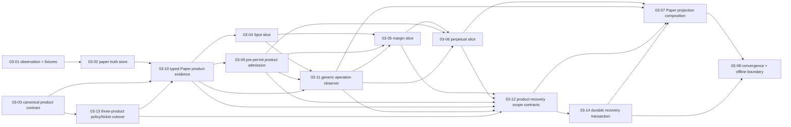

# Phase 03 Plan Validation — Paper Product Core

## Scope and Preserved Boundary

**Goal:** Operators safely practice complete, auditable Paper Spot, isolated-margin, and USDT-perpetual lifecycles without an external exchange.

**Requirement:** `SIM-01` supplies configurable Decimal balances, fees, slippage, leverage limits, deterministic fills, and restart recovery for all three products.

**Dispatch invariant:** `OutboundDispatchPermit -> SQLiteExecutionLedger.lease_outbound_submission() -> SubmissionCoordinator.submit() -> TradingGateway.submit_order(OutboundSubmission)` is still the only production submission route. `PaperGateway` accepts no free command, and `PaperEvidenceProjector`, paper control, recovery, observation, and kill-switch code have no permit, lease, or submit authority.

**Authority invariant:** Paper SQLite remains the independent account/order/fill/event truth. Central SQLite only receives idempotent audit projections. All plans are offline; no plan adds transport, exchange adapter, PyQt/UI, data/analysis/AI dependency, polling, or wall-clock fill path.

## Revised Acyclic Dependency Graph

| Wave | Plans | Why file ownership and dependencies are safe |
|---|---|---|
| 1 | `03-01`, `03-03` | Matcher/fixture and canonical product-context/migration owners are disjoint. |
| 2 | `03-02`, `03-13` | Store work is disjoint from central policy/ticket cutover, which follows canonical context. |
| 3 | `03-10` | Typed Paper product evidence waits for independent store and complete policy/context cutover. |
| 4 | `03-04`, `03-09` | Spot accounting and admission consume completed evidence without overlapping files. |
| 5 | `03-11` | One generic immutable observer/result contract cuts over port, callers, and gateway before product controls. |
| 6 | `03-05` | Margin extends shared gateway only after admission, target policy, and observer contracts. |
| 7 | `03-06` | Perpetual follows margin on shared gateway contracts. |
| 8 | `03-12` | Domain scope/evidence contracts wait for both product accounting slices and exact typed evidence. |
| 9 | `03-14` | Dedicated durable recovery migration and READY transaction follows the scope contract. |
| 10 | `03-07` | Projection migration/composition follows recovery persistence because both own central SQLite migrations and recovery correctness. |
| 11 | `03-08` | Final state-machine, automatic bridge, cancellation, restart, and READY convergence tests consume completed recovery/projection contracts. |

No same-wave file overlaps remain. `03-13` owns policy/ticket migration before `03-10`; `03-12` owns domain scope/evidence before `03-14` owns SQLite recovery persistence; every shared central SQLite, recovery, or gateway file has an explicit later dependency and the graph has no back edge.

## Checker-Finding Resolution

| Finding | Resolution | Executable proof |
|---|---|---|
| Wave-1 fixture conflict | `03-01` is the sole `tests/fixtures/paper_scenarios.py` owner. `03-02` no longer lists/modifies it and now depends on `03-01` in Wave 2. | Frontmatter file sets plus `test_paper_store.py` using the fixture without changing it. |
| Fixed-Spot policy/ticket guards | `03-13` performs the complete target-bound Spot/margin/perpetual policy, ticket, permit, and durable reconstruction cutover before `03-10` evidence/admission or margin/perpetual accounting. | Unit plus real-SQLite tests prove valid three-product tickets/permits, unsupported target/mode zero-authority rejection, and legacy Spot reads. |
| Product facts lacked a source-grounded read contract | `03-10` adds frozen pair/symbol evidence types, exact `TradingGateway` methods, scripted fake support, and PaperStore/PaperGateway persisted readers after policy cutover. | Gateway contract, fake, product-evidence, and reopened PaperStore tests reject cross-scope/stale/direct-store paths. |
| Projection bridge lacked an automatic seam | `03-11` assigns one observer owner per result: coordinator submit, PaperGateway advance/terminal cancellation, recovery lookup. `03-07` composes one bridge into those owners only. | Real SQLite integration performs all four operations without manual bridge calls or duplicate gateway/application delivery. |
| Durable recovery used aggregate/fixed-Spot assumptions | `03-12` defines exact target/product/pair-or-symbol scope and assessment; `03-14` persists it and atomically validates READY before `03-07`/`03-08`. | Product-scope real-SQLite tests deny forged/missing/cross-pair/cross-symbol/stale/restarted cases with zero authority effects. |
| Offline dependency warning | `03-08` retains the complete real paper lifecycle with outbound sentinels and import-boundary checks. | Offline-boundary regression runs with no credentials or network. |

## Locked Decision and Requirement Coverage

| Source | ID | Plan(s) | Measurable verification |
|---|---|---|---|
| REQUIREMENTS | SIM-01 | 03-01..03-14 | Focused offline tests per plan; 03-08 final corpus combines policies, scope contracts, durable recovery, projection, and convergence. |
| CONTEXT | D-01 | 03-01, 03-04, 03-08 | Explicit Decimal bid/ask/depth matching and offline lifecycle scenario. |
| CONTEXT | D-02 | 03-01, 03-04, 03-08 | Partial remainder survives until later observation/cancel and race coverage. |
| CONTEXT | D-03 | 03-01, 03-04..03-08 | Only explicit observations advance matching, valuation, interest, funding, or cancellation resolution. |
| CONTEXT | D-04 | 03-01, 03-03, 03-04..03-07 | Versioned Decimal provenance is canonical then persisted by batch/central projection. |
| CONTEXT | D-05 | 03-04, 03-08 | Spot reserve/settlement/release exactness and cancellation convergence. |
| CONTEXT | D-06 | 03-03, 03-13, 03-10, 03-09, 03-05, 03-12, 03-14, 03-08 | Target policy, pair evidence/admission/accounting, and durable pair recovery clearance. |
| CONTEXT | D-07 | 03-03, 03-13, 03-10, 03-09, 03-06, 03-12, 03-14, 03-08 | Target policy, exit/evidence/admission/accounting, and durable symbol recovery clearance. |
| CONTEXT | D-08 | 03-06, 03-12, 03-14, 03-08 | Deterministic liquidation facts gate durable recovery and post-reopen safety. |
| CONTEXT | D-09 | 03-02, 03-04, 03-11, 03-14, 03-07, 03-08 | Persisted sequence decides fill/cancel order, recovery transaction, observer reference, and batch projection order. |
| CONTEXT | D-10 | 03-02, 03-10, 03-04, 03-11, 03-12, 03-14, 03-07, 03-08 | Independent Paper truth backs product facts, durable recovery scope, references, and central projection. |
| CONTEXT | D-11 | 03-02, 03-05..03-08, 03-12, 03-14 | Version/digest cursor, scope identity, and generated stale/conflict schedules prevent regression. |
| CONTEXT | D-12 | 03-11, 03-07, 03-08, 03-09, 03-12, 03-13, 03-14 | Observer failure/recovery uses durable lookup with no resubmit or alternate authority.

## Product and Projection Ownership

| Layer | Owns | Must not own |
|---|---|---|
| `domain/models.py`, `domain/approval.py` | Protective exit, product-context canonicalization, ticket binding/invalidation | Mutable account/margin facts |
| `domain/risk.py`, `application/approval.py` | Immutable target-bound three-product policy selection and ticket issuance | Spot fallback, mutable policy settings, or direct dispatch |
| `evidence_collector.py`, `risk_engine.py` | Fresh scope-bound pre-permit product evidence and fail-closed risk | Context mutation, ticket/permit bypass, accounting |
| `recovery_evidence.py`, `recovery_assessment.py` | Exact product recovery scope and service-owned clearance contract | Aggregate/fixed-Spot clearance, caller scope/evidence, or dispatch |
| `kill_switch.py`, `sqlite_ledger.py`, migrations | Durable exact-scope recovery and atomic READY transition | Caller override, aggregate snapshot, or new dispatch authority |
| paper store/schema | Independent paper event/account/order/fill/book/snapshot truth | Central audit, tickets, permits, leases |
| product accounting | Spot reserve; pair-isolated margin; symbol-isolated one-way perpetual | Cross offsets, hedge/cross/auto-add modes |
| `PaperProjectionBatch` / projector | Read-only ordered audit input and idempotent central projection | Paper truth mutation or outbound capability |
| `GatewayOperationObserver`; `PaperTradingRuntime` | Exactly-once immutable result forwarding; one bridge composition injection | Paper batch knowledge in generic code, direct command submit, terminal fabrication, retry |

## Source Audit

SOURCE | ID | Feature / Constraint | Plan | Status | Notes
--- | --- | --- | --- | --- | ---
GOAL | — | Complete safe/auditable offline paper lifecycle | 03-01..03-14 | COVERED | Contracts, target policies/tickets, durable evidence/recovery, product accounting, automatic projection, and hardening sequence. |
REQ | SIM-01 | Balances, economics, leverage, deterministic fills, restart | 03-01..03-14 | COVERED | Every product capability and durable policy/recovery boundary has focused offline behavior coverage. |
RESEARCH | Independent paper truth and observation transaction | 03-01, 03-02 | COVERED | Pure matcher plus durable sequence/cursor store. |
RESEARCH | Product policy, fact, and ticket authority | 03-03, 03-13, 03-10, 03-09 | COVERED | Canonical context, target policy/ticket persistence, typed evidence, then fail-closed admission. |
RESEARCH | Separate product accounting | 03-04..03-06 | COVERED | Dedicated Spot/margin/perpetual projectors. |
RESEARCH | Durable product-scope recovery | 03-12, 03-14 | COVERED | Scope/evidence contract then exact SQLite persistence and atomic READY transition precede convergence. |
RESEARCH | Generic post-operation and unified Paper projection | 03-11, 03-07 | COVERED | One-owner automatic observer delivery and one runtime composition precede read-only batch-to-central bridge. |
RESEARCH | Fault/cancel/restart and offline isolation | 03-08 | COVERED | State machine, three-product convergence, sentinel, and import-boundary corpus. |
CONTEXT | D-01..D-12 | Locked decisions | 03-01..03-14 | COVERED | Individually mapped above; no deferred item exists. |

## Verification Matrix

| Plan | Focused automated verification |
|---|---|
| 03-01 | `tests/unit/execution/test_paper_matching.py tests/unit/execution/test_models.py` |
| 03-02 | `tests/integration/execution/test_paper_store.py tests/unit/execution/test_paper_matching.py` |
| 03-03 | `tests/unit/execution/test_paper_product_models.py tests/integration/execution/test_paper_product_migration.py tests/integration/execution/test_approval_consumption.py tests/integration/execution/test_uncertain_recovery.py` |
| 03-13 | `tests/unit/execution/test_paper_product_policy_ticket.py tests/integration/execution/test_paper_product_policy_ticket.py tests/integration/execution/test_approval_consumption.py` |
| 03-10 | `tests/unit/execution/test_gateway_contract.py tests/unit/execution/test_paper_product_evidence.py tests/integration/execution/test_paper_store.py` |
| 03-04 | `tests/unit/execution/test_paper_spot.py tests/integration/execution/test_paper_spot_recovery.py tests/unit/execution/test_gateway_contract.py` |
| 03-09 | `tests/unit/execution/test_paper_product_admission.py tests/unit/execution/test_risk_engine.py tests/integration/execution/test_approval_consumption.py` |
| 03-11 | `tests/unit/execution/test_gateway_contract.py tests/unit/execution/test_gateway_operation_bridge.py tests/integration/execution/test_approval_consumption.py tests/integration/execution/test_uncertain_recovery.py` |
| 03-05 | `tests/unit/execution/test_paper_margin.py tests/integration/execution/test_paper_margin_recovery.py tests/unit/execution/test_paper_spot.py` |
| 03-06 | `tests/unit/execution/test_paper_perpetual.py tests/integration/execution/test_paper_perpetual_liquidation.py tests/unit/execution/test_paper_margin.py` |
| 03-12 | `tests/unit/execution/test_paper_recovery_product_scope.py tests/unit/execution/test_paper_product_evidence.py tests/unit/execution/test_gateway_contract.py` |
| 03-14 | `tests/integration/execution/test_paper_recovery_product_scope.py tests/integration/execution/test_kill_switch.py tests/integration/execution/test_uncertain_recovery.py tests/integration/execution/test_approval_consumption.py` |
| 03-07 | `tests/unit/execution/test_paper_projection.py tests/integration/execution/test_paper_ledger_projection.py tests/unit/execution/test_gateway_operation_bridge.py tests/integration/execution/test_uncertain_recovery.py` |
| 03-08 | `tests/property/execution/test_paper_state_machine.py tests/integration/execution/test_paper_fault_recovery.py tests/integration/execution/test_paper_kill_switch_convergence.py tests/integration/execution/test_paper_offline_boundary.py` |

## Final Phase Gate

Run the exact focused corpus in `03-08-PLAN.md`. It includes product policy/ticket, product evidence/admission, durable recovery scope, automatic projection, real offline boundary, and final convergence suites alongside matching, accounting, restart, and provenance checks.

## Explicit Non-Goals

- No network, exchange adapter, credential path, PyQt/UI, market-data pipeline, or analysis/data/AI dependency.
- No cross/portfolio margin, hedge position mode, auto-add margin, generic leverage, unprotected perpetual entry, mutable post-analysis product injection, or caller-built risk evidence.
- No clock-driven lifecycle, central-ledger paper authority, terminal inference from timeout/cancel request, automatic resubmission, or projector outbound authority.
- No modification of user work in `pa_agent/trading/application/__init__.py`, `pa_agent/trading/persistence/sqlite_connection.py`, or `tests/integration/execution/test_sqlite_ledger.py` is assumed; executors must preserve it.
