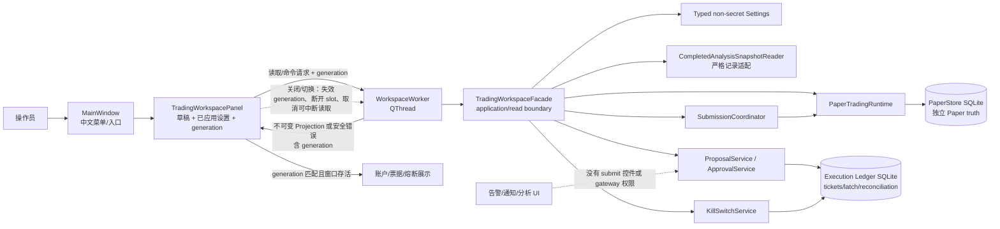

# Phase 4: Local Trading Workspace - Research

**Researched:** 2026-07-14  
**Domain:** PyQt6 本地交易工作区、持久化 Paper 交易投影与 Qt 线程隔离  
**Confidence:** MEDIUM

<user_constraints>
## User Constraints (from CONTEXT.md)

### Locked Decisions

### Configuration Workflow
- **D-01:** Organize settings as progressive sections. The operator first chooses mode, target, product, and account; show only configuration applicable to that explicit selection. Paper remains the default; Testnet and disabled Live remain visibly distinct.
- **D-02:** On venue, environment, account, or product changes, retain unsaved edits as a draft but revalidate every affected setting. Approval stays unavailable until the operator explicitly saves and the newly selected configuration passes validation.
- **D-03:** Provide both immediate field-level validation and a fixed, centralized readiness summary. The summary is the single global indication of whether the current applied configuration can enter the approval flow, and must identify blocking errors, warnings, and their owning configuration section.
- **D-04:** A draft becomes applied configuration only through an explicit **Save and validate** action. Persist only validated non-secret settings; visibly distinguish the current applied configuration from unsaved edits.

### Account-State Workspace
- **D-05:** Make balances and positions the primary first-screen content. Connection, reconciliation, readiness, and kill-switch indicators remain present but secondary to the account view.
- **D-06:** Group Spot, isolated-margin, and USDT-perpetual balances, positions, orders, and fills by product. Provide a read-only cross-product summary for orientation only; it must not calculate risk or establish approval eligibility.
- **D-07:** Show each account-data section's last successful reconciliation time, source, and freshness independently. Stale data remains inspectable but is clearly marked, and the UI must not make it appear eligible for approval.
- **D-08:** Keep kill-switch state (READY, LATCHED, or RECOVERING) continuously visible. Trigger and recovery actions open an explicit confirmation flow that displays persisted preconditions and blocking reasons; the UI cannot bypass existing service validation or reconciliation requirements.

### Claude's Discretion
- Exact PyQt widget/module boundaries, table columns, visual density, navigation controls, status wording, worker-object arrangement, and test-helper structure may follow established repository patterns, provided they preserve the decisions and Phase 1–3 authority boundaries above.

### Deferred Ideas (OUT OF SCOPE)

None — discussion stayed within the fixed Phase 4 scope.
</user_constraints>

<phase_requirements>
## Phase Requirements

| ID | Description | Research Support |
|----|-------------|------------------|
| UI-01 | 提供交易模式、场所、账户/产品、symbol 映射、Paper 余额、杠杆/保证金、风险限额和非秘密连接设置的配置 UI。 | 使用 Pydantic `TradingSettings` 的 `extra="forbid"` 持久化边界；以草稿/已应用快照、服务端验证结果和显式保存替代 widget 自行判定。[VERIFIED: pa_agent/config/settings.py:159-180, 230-293; pa_agent/gui/settings_dialog.py:49-69, 396-457] |
| UI-02 | 展示连接、余额、持仓、未结订单、近期成交、网关错误和 kill-switch 状态。 | 读取 `TradingGateway` 的 canonical 账户/订单契约、Paper 独立持久化快照、账本未完成对账任务和持久化 kill switch；新增只读聚合投影，不让 widget 读 SQLite。[VERIFIED: pa_agent/trading/ports/gateway.py:73-170; pa_agent/trading/gateways/paper/store.py:531-632; pa_agent/trading/ports/ledger.py:203-277] |
| UI-03 | 从合格的已持久化分析记录呈现 typed approval ticket，允许明确批准或拒绝；告警/通知不可提交。 | `ApprovalTicket.review` 已封装完整不可变审阅信息；拒绝通过 `ApprovalService.reject_ticket`，消费只经 `ApprovalService.consume_ticket` → SQLite permit → `SubmissionCoordinator`。现有记录到 `SourceAnalysisSnapshot` 的生产适配器缺失，必须先补齐严格只读适配器。[VERIFIED: pa_agent/trading/domain/approval.py:596-695; pa_agent/trading/application/approval.py:26-123; pa_agent/trading/application/submission.py:12-41; pa_agent/trading/ports/analysis_records.py:1-14] |
| NFR-01 | 任何交易所网络请求均不得阻塞 Qt UI 线程。 | 复用 QThread + signal、取消、generation token、断开回调和 zombie reaping 模式；所有连接、验证、提交、取消、恢复和投影刷新都在工作线程执行，主线程只渲染不可变结果。[VERIFIED: pa_agent/gui/main_window.py:805-930, 2788-3015, 4003-4012; pa_agent/gui/snapshot_worker.py:1-32; pa_agent/util/threading.py:1-31] [CITED: https://doc.qt.io/qt-6/threads-qobject.html] |
</phase_requirements>

## Project Constraints (from CLAUDE.md)

- 未发现仓库本地 `./.claude/CLAUDE.md`；因此没有额外的项目级 CLAUDE 指令可复制。[VERIFIED: Read `.claude/CLAUDE.md` returned not found]
- Phase 4 不安装新的第三方包；必须复用已声明的 PyQt6、Pydantic、pytest 和 pytest-qt。[VERIFIED: pyproject.toml]
- 面向操作员的新增文本必须使用简体中文；本研究中的英文仅为规划/代码标识，不是产品 UI 文案。[VERIFIED: phase assignment contract]

## Summary

Phase 4 应交付一个**薄的、generation-scoped 的 PyQt6 展示与命令外壳**：`MainWindow` 只负责挂载入口，专用 trading panel 维护草稿、已应用设置和当前 workspace generation；后台 worker 只调用一个由 `AppContext` 组合的交易工作区 façade；worker 回传不可变投影或受控错误；主线程仅在 generation 仍匹配且窗口仍存活时渲染。这样沿用现有 `SnapshotFetchWorker`、`AnalysisPrepWorker` 和 `MainWindow` 的取消/失效协议，而不会把网关、SQLite、风险或审批逻辑移入 widget。[VERIFIED: pa_agent/gui/snapshot_worker.py:1-32; pa_agent/gui/analysis_prep_worker.py:12-86; pa_agent/gui/main_window.py:805-930, 2811-3015]

当前执行层已经具备 Paper gateway、只读 Paper operation projection、票据、租约提交、恢复和持久化 kill switch；但它**没有**面向桌面工作区的一体化只读 read model，也没有 `CompletedAnalysisSnapshotReader` 的具体生产实现。还存在两个必须在计划中显式关闭的缺口：现有 `AnalysisRecord` 没有 stable execution source ID、canonical recommendation、parser/schema 版本或 repaired 标记；而 Paper store 的公开读取只支持单 scope snapshot、按 command 的 fills 和 open orders。不能让 UI 直接解析 SQLite 或从图表/CSV/alert 推断这些事实；应在 application/read 层补足严格的适配器和只读 projection service。[VERIFIED: pa_agent/records/schema.py:12-43; pa_agent/trading/ports/analysis_records.py:1-14; pa_agent/trading/gateways/paper/store.py:531-632; pa_agent/trading/application/paper_projection.py:41-114]

**Primary recommendation:** 在 `pa_agent/trading/qt/` 新建一个只依赖 typed application/port API 的 `TradingWorkspaceController`、`WorkspaceWorker` 和不可变 `WorkspaceProjection`；由 `AppContext` 唯一组合服务，并将每个后台结果以 workspace generation、目标摘要和取消状态回传给 GUI。[VERIFIED: pa_agent/app_context.py:9-147; pa_agent/gui/main_window.py:2811-3015]

## Architectural Responsibility Map

| Capability | Primary Tier | Secondary Tier | Rationale |
|------------|--------------|----------------|-----------|
| 草稿、字段即时校验、已应用/未保存标识和中文状态渲染 | Browser / Client（Qt GUI） | API / Backend（trading application） | GUI 拥有交互状态，但最终配置合法性与 readiness 来自 typed service，不来自 widget 自己的风险判断。[VERIFIED: pa_agent/gui/settings_dialog.py:49-69, 396-457; pa_agent/config/settings.py:159-180] |
| 非秘密设置验证与保存 | API / Backend（application/config boundary） | Browser / Client | Pydantic 模型和 `save_settings` 是唯一持久化入口；GUI 只提交草稿副本。[VERIFIED: pa_agent/config/settings.py:159-180, 230-293] |
| Paper 账户、订单、成交、对账和 freshness 投影 | API / Backend（read-only projection service） | Database / Storage | 交易 source of truth 是 PaperStore/ledger；UI 不能从图表、CSV 或 widget 缓存建立事实。[VERIFIED: pa_agent/trading/gateways/paper/store.py:142-156, 531-632; pa_agent/trading/application/paper_projection.py:41-114] |
| typed approval ticket 的查看、拒绝、消费/提交 | API / Backend（ApprovalService / SubmissionCoordinator） | Browser / Client | 票据和 permit 的权限由 ledger 服务拥有；UI 只请求命令并显示返回投影。[VERIFIED: pa_agent/trading/application/approval.py:26-123; pa_agent/trading/application/submission.py:12-41] |
| kill switch 锁存、取消和恢复 | API / Backend（KillSwitchService / ledger） | Browser / Client | GUI 触发需显式确认，但存储前置条件、取消和恢复的核验均在既有服务/ledger 中完成。[VERIFIED: pa_agent/trading/application/kill_switch.py:13-119; pa_agent/trading/ports/ledger.py:226-266] |
| 阻塞式 gateway/SQLite/恢复/提交工作 | API / Backend worker thread | Browser / Client | QWidget 只能在主线程使用；阻塞 I/O 只能在后台 worker 调用并以 queued signal 回到 GUI。[CITED: https://doc.qt.io/qt-6/threads-qobject.html] |

## Standard Stack

### Core

| Library | Version | Purpose | Why Standard |
|---------|---------|---------|--------------|
| PyQt6 | 已安装 6.11.0；项目声明 `>=6.6` | Qt widgets、signals、QThread 和应用事件循环 | 当前 GUI、worker 和主题已经建立于 PyQt6；继续复用避免第二种并发/渲染模型。[VERIFIED: `.venv/bin/python` import check; pyproject.toml; pa_agent/gui/main_window.py:7-8] [CITED: https://doc.qt.io/qt-6/qthread.html] |
| Pydantic | 项目声明 `>=2.7` | 非秘密 settings 的 typed validation 和 JSON serialization | `TradingSettings` 已以 `extra="forbid"` 拒绝未声明/secret-like 字段，适合扩展受控 Paper 工作区设置。[VERIFIED: pyproject.toml; pa_agent/config/settings.py:159-180] |
| pytest + pytest-qt | 已安装 pytest-qt 4.5.0；项目声明 pytest `>=8` / pytest-qt `>=4.4` | Qt 事件循环、signal 和异步状态测试 | 已有 e2e 测试注册 `MainWindow` 并使用 `qtbot.waitUntil`，应直接扩展为 trading workspace 测试。[VERIFIED: `.venv/bin/python` import check; pyproject.toml; tests/e2e/test_smoke_happy_path.py:62-82] [CITED: https://pytest-qt.readthedocs.io/en/latest/reference.html] |

### Supporting

| Library / component | Version | Purpose | When to Use |
|---------------------|---------|---------|-------------|
| `CancelToken` | repository utility | cooperative cancellation | target/workspace switch 或关闭窗口时，让可中断 worker 停止后续读取；不能用它伪造已发生的交易命令回滚。[VERIFIED: pa_agent/util/threading.py:8-31] |
| `SQLiteExecutionLedger` | repository component | tickets、kill switch、reconciliation jobs 和中心审计投影 | 所有 approval/kill-switch/reconciliation 状态的持久化 source；UI 不直接操作其连接。[VERIFIED: pa_agent/trading/ports/ledger.py:147-277; pa_agent/trading/persistence/sqlite_ledger.py:1202-1247] |
| `PaperTradingRuntime` | repository component | Paper gateway、projection bridge、submission/recovery composition | 在 `AppContext` 唯一构造并关闭；widget 只接触 façade 暴露的投影/命令。[VERIFIED: pa_agent/trading/application/paper_runtime.py:39-75] |
| `SecretRedactor` | repository component | 交易输出/错误递归脱敏 | worker error、状态文本和日志展示前使用；不得呈现 raw gateway exception、credentials 或签名材料。[VERIFIED: pa_agent/trading/security/redaction.py:1-83] |

### Alternatives Considered

| Instead of | Could Use | Tradeoff |
|------------|-----------|----------|
| 复用既有 QThread subclass + generation guard | 在 UI 中同步调用 Paper gateway，或引入 asyncio/thread-pool 新模型 | 同步调用违反 NFR-01；新并发模型会绕过已验证的 signal/cancel/disconnect 模式。[VERIFIED: pa_agent/gui/main_window.py:805-930, 2788-3015] [CITED: https://doc.qt.io/qt-6/threads-qobject.html] |
| application-level read-only workspace projection | widget 直读 PaperStore / ledger SQLite 表 | 直读会泄漏 schema、将持久化细节耦合到 GUI，并容易把 projection 当作 authority。[VERIFIED: pa_agent/trading/application/paper_projection.py:108-145; pa_agent/trading/persistence/sqlite_ledger.py:686-698] |
| `ApprovalService` + `SubmissionCoordinator` | 在 approval dialog 中构造 command 或直接调用 gateway | 既有服务保证 fresh evidence、一次性 permit/lease 和 ambiguous outcome 处理；直接调用会绕过权限边界。[VERIFIED: pa_agent/trading/application/approval.py:62-123; pa_agent/trading/application/submission.py:12-41] |

**Installation:** 不执行安装。Phase 4 复用仓库已声明和当前虚拟环境已有的依赖。[VERIFIED: pyproject.toml; `.venv/bin/python` import check]

## Architecture Patterns

### System Architecture Diagram



该图的关键边界是：worker 可以调用既有 application service，但 `TradingWorkspacePanel` 不得调用 `TradingGateway`、`PaperStore` 或 `SQLiteExecutionLedger`；alert/notification 路径没有 façade 的消费或提交方法。[VERIFIED: pa_agent/trading/ports/gateway.py:73-170; pa_agent/trading/application/submission.py:12-41; pa_agent/trading/application/proposal.py:27-121]

### Recommended Project Structure

```text
pa_agent/
├── app_context.py                         # 唯一组合 runtime、facade 和关闭生命周期
├── config/settings.py                     # 非秘密、extra-forbid 的 applied settings 模型
├── gui/
│   ├── main_window.py                     # 仅添加“交易工作区”顶层入口与关闭转发
│   ├── trading_panel.py                   # 主工作区容器、generation、中文渲染
│   ├── trading_config_panel.py            # 草稿/已应用配置和集中 readiness
│   ├── trading_account_panel.py           # 只读账户、订单、成交和 freshness 展示
│   ├── trading_approval_dialog.py         # typed ticket review / 明确确认
│   └── trading_kill_switch_dialog.py      # 显示持久化前置条件的确认流程
└── trading/
    ├── application/workspace_projection.py # 只读 DTO、投影服务和受控命令 façade
    ├── ports/analysis_records.py           # 复用并实现 completed-record reader
    └── qt/workspace_worker.py              # QThread 请求/结果协议；无 QWidget

tests/
├── unit/execution/test_workspace_projection.py
├── integration/execution/test_completed_analysis_snapshot_reader.py
└── e2e/execution/test_trading_workspace.py
```

新 `trading/qt/` 只承载 Qt 线程桥接，不拥有交易策略/生命周期/风险规则；可复用 visual primitive 才进入 `gui/widgets/`，否则保持 purpose-named panel sibling。[VERIFIED: .planning/codebase/STRUCTURE.md; .planning/codebase/CONVENTIONS.md]

### Pattern 1: Generation-scoped worker result application

**What:** 每次加载、保存验证、提交/取消、对账或 kill-switch 命令都生成一个不可变 request generation；callback 先检查 generation 和 `_ui_is_alive()`，再触碰 widget。切换 target/product 或关闭面板时先失效 generation，再断开信号并请求 cooperative cancel；对已进入 durable service 的命令只忽略过期 UI 回调，绝不“撤销”其真实持久化副作用。

**When to use:** 所有可能延迟、失败或在切换/关闭后返回的 gateway、SQLite、record-reader、reconciliation 和 command 操作。

**Example:**

```python
# Source pattern: pa_agent/gui/main_window.py:2811-2848, 2890-2918, 3000-3015
request_id = object()
self._workspace_request_id = request_id


def _apply_result(result: WorkspaceProjection) -> None:
    if self._workspace_request_id is not request_id:
        return
    if not self._ui_is_alive():
        return
    self._account_panel.set_projection(result)
```

现有 `MainWindow` 已对 snapshot、prep 和 analysis worker 使用此模式；Phase 4 必须对每一个 workspace worker 复用它，而非仅在刷新路径使用。[VERIFIED: pa_agent/gui/main_window.py:2811-2848, 2890-2918, 2998-3015]

### Pattern 2: Draft → explicit validate → applied snapshot

**What:** 初始化时从 `Settings.trading` 复制已应用值到 immutable/applied snapshot；编辑只更新草稿。字段级 validator 立即显示局部错误，后台 validation worker 请求 façade 返回 section-keyed issue list 和统一 readiness；只有“保存并验证”成功后才将 Pydantic-validated non-secret candidate 写入 `settings` 和 `save_settings`。

**When to use:** 模式、venue、account、product、symbol mapping、Paper 初始余额、isolated-margin/perpetual context 和任何局部风险限制的变更。

**Required guard:** 当前 `TradingSettings` 只允许 `paper-spot` 和 `phase2-v1`。计划必须先将其演进为只允许已支持 Paper targets/products 的 typed schema，并保留 `extra="forbid"`、opaque `CredentialReference` 和 Testnet/Live 的 disabled display state；不得把 secret field、endpoint secret 或 raw credential 写进 generic settings。[VERIFIED: pa_agent/config/settings.py:159-180; tests/integration/execution/test_secret_nonpersistence.py:69-105]

### Pattern 3: Read-only product projection, not a synthetic risk projection

**What:** application 层构建 `WorkspaceProjection`，按 Spot、isolated-margin、USDT-perpetual 输出独立的 balances/positions/orders/fills、source、last-successful reconciliation time 和 freshness。cross-product summary 只提供 display totals/counts/labels，不计算 exposure，也不设置 approval eligibility。

**When to use:** UI-02 的首次加载、手动刷新、后台 reconcile 完成后和重开工作区后。

**Required gap closure:** `PaperGateway.get_account_snapshot()` 当前仅提供 Spot `Balance`，对 isolated margin 返回空 account snapshot，perpetual 不走该 generic 方法；`PaperStore` 只公开单 scope snapshot、open orders 和按 command 的 fills。因此 façade 必须在 source-of-truth 附近增加**版本化、只读、产品专用** query/projection API，统一读取 persisted `PaperProductSnapshot`/canonical evidence；不得在 GUI 执行 SQL 或把未经版本检查的 `payload` dict 当作 canonical fact。[VERIFIED: pa_agent/trading/gateways/paper/gateway.py:159-220, 416-438; pa_agent/trading/gateways/paper/store.py:124-140, 531-632]

### Pattern 4: Ticket review stays a command boundary

**What:** 票据面板只展示 `ApprovalTicket.review` 的 typed fields（venue、environment、account、product、side、amount、price/slippage、fee、data age、source provenance、risk result）和 terminal status。拒绝调用 `ApprovalService.reject_ticket`；确认由 worker 调用 `ApprovalService.consume_ticket`，仅把返回的 permit 交给 `SubmissionCoordinator.submit`。失败、freshness 变化、expired、rejected/revoked 都重新读取 persisted ticket/projection，不假定成功或终态。

**When to use:** 合格的持久化分析记录进入 ticket flow 后。

**Required gap closure:** `CompletedAnalysisSnapshotReader` 目前仅是 Protocol；`AnalysisRecord` 也没有 `SourceAnalysisSnapshot` 所需的 stable `source_id`、canonical typed recommendation、decision digest、schema/parser version、repaired 状态。现有 `stage2_decision` 是无 schema `dict`，且现有 fixture 的 `decision` 不含 canonical quantity/risk basis。因此计划必须新增严格 adapter：缺失、过期（现为 60 秒）、repaired、digest 不匹配、缺 Decimal quantity/risk basis 或不支持产品的记录只能返回 controlled ineligible result，绝不能从 chart、CSV、alert、notification 或 UI 默认值补造输入。[VERIFIED: pa_agent/trading/ports/analysis_records.py:1-14; pa_agent/records/schema.py:26-43; pa_agent/trading/application/intent_factory.py:27-134; tests/integration/conftest.py:42-104]

### Anti-Patterns to Avoid

- **Widget 直接调用 gateway / SQLite / `PaperStore`:** 会把 I/O、schema 及 authority 带进 UI；使用 worker → façade → typed port。[VERIFIED: pa_agent/trading/ports/gateway.py:73-170; pa_agent/trading/application/paper_projection.py:108-145]
- **在主线程 `wait()` 等待交易 worker:** 即使 Paper 当前是本地 SQLite，未来 gateway 会阻塞；切换/关闭仅立即失效结果、取消可中断读取、断开 signal 并追踪未结束 worker。[VERIFIED: pa_agent/gui/main_window.py:744-803, 848-910] [CITED: https://doc.qt.io/qt-6/threads-qobject.html]
- **过期 callback 重新启用按钮或覆盖新 target:** 每个 callback 都必须检查 generation、active target digest 和 UI alive；关闭后只释放 UI references。[VERIFIED: pa_agent/gui/main_window.py:2814-2848, 2890-2918, 3000-3015]
- **用 cross-product summary 计算风险或批准资格:** 风险 eligibility 必须继续由 `FreshEvidenceCollector` 和 `RiskEngine` 使用 exact target/product evidence 决定。[VERIFIED: pa_agent/trading/application/proposal.py:62-121; pa_agent/trading/domain/risk.py:336-362]
- **把配置字段当成 UI 风控 authority:** 现有 `RiskPolicy` 只接受固定 Paper 限额；若提供“风险限额”编辑，必须由 application/policy construction 层证明它只会收紧既有硬上限，GUI 不得自己声明可批准。[VERIFIED: pa_agent/trading/domain/risk.py:255-308, 365-449]
- **在 alert/notification/DecisionPanel 添加提交控件:** 这些路径仍是 advisory-only；仅 trading workspace façade 暴露 operator-confirmed command。[VERIFIED: .planning/phases/02-approval-and-risk-boundary/02-VERIFICATION.md]

## Don't Hand-Roll

| Problem | Don't Build | Use Instead | Why |
|---------|-------------|-------------|-----|
| Qt 线程通信 | 在 Python thread 中直接写 QWidget，或手工轮询 UI 状态 | QThread 的 signals + 主线程 slot | QWidget 不是可重入类；cross-thread queued signal 将 slot 运行在 receiver 线程。[CITED: https://doc.qt.io/qt-6/threads-qobject.html] |
| stale callback 防护 | “当前 worker 指针相等”这种隐式状态判断 | request generation + active target digest + `_ui_is_alive()` guards | 已有 snapshot/prep/analysis 回调采用该可验证协议。[VERIFIED: pa_agent/gui/main_window.py:805-930, 2814-2848, 2890-2918] |
| Approval 权限 | dialog 自己构造 `OutboundSubmission` 或调用 `gateway.submit_order` | `ApprovalService.consume_ticket` → `SubmissionCoordinator.submit` | SQLite lease 防止 forged/replayed dispatch，并把异常标记为 ambiguous。[VERIFIED: pa_agent/trading/application/approval.py:62-123; pa_agent/trading/application/submission.py:12-41] |
| Kill-switch reset | checkbox 直接切回 READY | `KillSwitchService.begin_recovery` / `complete_recovery` | 服务收集 fresh exact-scope evidence，ledger 只允许受控状态转换。[VERIFIED: pa_agent/trading/application/kill_switch.py:60-119; tests/integration/execution/test_kill_switch.py:190-231] |
| JSON dict 账户/成交视图 | GUI 解析随机 SQL/record 字段 | immutable `WorkspaceProjection` 和版本化 Paper projection reader | 现有 Paper projection 已明确是 immutable、one-way audit projection。[VERIFIED: pa_agent/trading/application/paper_projection.py:18-145] |
| secret filtering | 每个 panel 各自 `replace()` 或隐藏字段 | `SecretRedactor` 和 allowlisted settings schema | 统一 redactor 覆盖 nested exceptions、headers 和 sensitive key shapes。[VERIFIED: pa_agent/trading/security/redaction.py:37-83; tests/integration/execution/test_secret_nonpersistence.py:69-105] |

**Key insight:** Phase 4 的复杂性不是绘制表格，而是维护“当前可见 workspace”与“可能在后台完成的持久化工作”之间的正确边界。stale UI 结果可以丢弃；已经提交给既有 durable service 的真实状态绝不能由 GUI 猜测、回滚或替代。[VERIFIED: pa_agent/trading/application/submission.py:12-41; pa_agent/trading/application/recovery.py:18-57]

## Common Pitfalls

### Pitfall 1: 将已保存的分析记录误认为可执行提案

**What goes wrong:** 当前 `AnalysisRecord.stage2_decision` 是松散 dict，且记录没有 `SourceAnalysisSnapshot` 的 execution identity/typed Decimal fields；UI 若直接从现有 decision 或 chart 默认值构造 ticket，会绕过明确的 conversion contract。  
**Why it happens:** `CompletedAnalysisSnapshotReader` 只有 protocol，没有实现；`IntentFactory` 正确地只接受 typed snapshot，并拒绝 stale/repaired/digest-invalid 值。  
**How to avoid:** 先实现严格只读 record adapter 和 ineligible reason projection；只有 adapter 返回完整、fresh、canonical snapshot 后才调用既有 `ProposalService`。  
**Warning signs:** 任一 ticket 的 source ID 来自文件路径/label、缺 risk basis/quantity、或 UI 能在不存在 `SourceAnalysisSnapshot` 时发起 approve。  
[VERIFIED: pa_agent/trading/ports/analysis_records.py:1-14; pa_agent/records/schema.py:26-43; pa_agent/trading/application/intent_factory.py:35-84]

### Pitfall 2: 把 Paper 的本地性误解为可以在 UI thread 执行

**What goes wrong:** Paper Store SQLite、future connection validation 或 recovery 在 UI 线程运行，短期看似正常，后续 gateway/timeout 时冻结窗口。  
**Why it happens:** `TradingGateway` 是同步 contract，`ApprovalService.consume_ticket` 会刷新 evidence，`SubmissionCoordinator.submit` 会调用 gateway。  
**How to avoid:** 所有 façade 操作均从 `WorkspaceWorker.run()` 执行，主线程只收 signal；测试用 delayed fake 验证 event loop 和可点击控件仍存活。  
**Warning signs:** button handler 出现 `get_*`、`consume_ticket`、`submit`、`recover_*`、SQLite 查询或 `worker.wait(timeout>0)`。  
[VERIFIED: pa_agent/trading/ports/gateway.py:73-170; pa_agent/trading/application/approval.py:62-123; pa_agent/trading/application/submission.py:12-41] [CITED: https://doc.qt.io/qt-6/threads-qobject.html]

### Pitfall 3: stale worker 覆盖已切换/关闭的 workspace

**What goes wrong:** 从旧 account/product 返回的 callback 重新绘制新 workspace、重新启用 approve，或关闭后访问已删除 widget。  
**Why it happens:** `QThread` 不会因丢失 Python 引用自动停止；已发出的 queued signals 也可能在切换后到达。  
**How to avoid:** 切换时先增 generation/clear active ID，断开 slots，再请求 cancel；callback 同时验证 generation、target digest 和 `_ui_is_alive()`；关闭时不再绑定 UI callback。  
**Warning signs:** callback 只检查 `worker is self._worker`，或者 close handler 没有失效 request ID。  
[VERIFIED: pa_agent/gui/main_window.py:805-910, 2814-2848, 2890-2918, 4003-4012] [CITED: https://doc.qt.io/qt-6/threads-qobject.html]

### Pitfall 4: 用 summary 或取消请求宣称对账/风险已经安全

**What goes wrong:** cross-product totals 被用于 exposure/approval，或 cancel requested 被显示为已取消、可以解除 kill switch。  
**Why it happens:** UI 想简化产品语义和 lifecycle；而已持久化取消请求故意不代表 remote terminal evidence。  
**How to avoid:** summary 固定为“仅供查看”；每个产品 panel 展示独立 observed-at/source/freshness；恢复 UI 调用既有服务并展示 ledger 返回的 blocking state。  
**Warning signs:** READY 由 UI 本地 bool 决定，或 cancellation work 成功就允许 recovery。  
[VERIFIED: pa_agent/trading/domain/approval.py:235-257; pa_agent/trading/application/kill_switch.py:35-119; tests/integration/execution/test_kill_switch.py:157-231]

### Pitfall 5: 将风险控制配置放宽为用户输入

**What goes wrong:** UI persistence 可提高 notional、leverage、open order 或 loss/drawdown 上限，破坏已有 Paper hard limits。  
**Why it happens:** UI-01 要求显示风险限额，但当前 `RiskPolicy` 是 fixed-value policy，没有“任意用户覆盖”入口。  
**How to avoid:** 将可编辑字段限制为严格收紧值，并在 application policy factory 中比较 immutable baseline；若没有可证明的收紧 API，则暂以只读、明确标注的 policy values 展示，不能伪装成已应用的可编辑限制。  
**Warning signs:** `TradingSettings` 接受大于基线的数值，或 widget 自行决定 readiness 为 true。  
[VERIFIED: pa_agent/trading/domain/risk.py:255-308, 365-449]

## Code Examples

Verified repository and official patterns:

### Worker completion test with deterministic signal/state wait

```python
# Source: tests/e2e/test_smoke_happy_path.py:68-82
window = MainWindow(ctx)
qtbot.addWidget(window)
window.show()

# Start the asynchronous action first, then wait for observable completion.
window._on_submit_analysis()
qtbot.waitUntil(lambda: not window._analysis_in_progress, timeout=10_000)
```

`qtbot.addWidget()` guarantees teardown closes the window; `waitUntil()` drives the Qt event loop until an asynchronous observable condition holds, avoiding sleep-based flakes.[CITED: https://pytest-qt.readthedocs.io/en/latest/reference.html] [CITED: https://pytest-qt.readthedocs.io/en/latest/wait_until.html]

### Ticket review without granting submission to the view

```python
# Source: pa_agent/trading/domain/approval.py:621-669
# The view receives a durable ticket and renders only its immutable review.
review = ticket.review
show_ticket(
    venue=review.venue,
    account_id=review.account_id,
    amount=review.amount,
    data_observed_at=review.data_observed_at,
    risk_result=review.risk_result,
)

# Command execution stays in a worker-owned application façade.
permit = approval_service.consume_ticket(ticket.ticket_id, candidate, target, policy)
if permit is not None:
    submission_coordinator.submit(permit)
```

The UI must never replace the final two lines with `gateway.submit_order(...)`; only the coordinator can obtain the leased gateway-facing authorization.[VERIFIED: pa_agent/trading/application/approval.py:62-123; pa_agent/trading/application/submission.py:12-41]

## State of the Art

| Old Approach | Current Approach | When Changed | Impact |
|--------------|------------------|--------------|--------|
| GUI-held mutable order/account state | independently durable Paper truth plus immutable one-way central projection | Phase 3 | UI must render persisted projection/read model rather than create lifecycle facts.[VERIFIED: pa_agent/trading/application/paper_projection.py:41-145; .planning/phases/03-paper-product-core/03-VERIFICATION.md] |
| caller-created outbound submission | ticket consumption → one-time SQLite permit/lease → coordinator → gateway | Phase 2–3 | Approval panel can request an existing command only; it cannot manufacture dispatch authority.[VERIFIED: pa_agent/trading/application/submission.py:12-41; .planning/phases/02-approval-and-risk-boundary/02-VERIFICATION.md] |
| unguarded worker completion | generation-scoped callbacks plus cancellation/disconnect/zombie reaping | existing MainWindow pattern | Phase 4 must apply the existing guard to every trading worker and window close path.[VERIFIED: pa_agent/gui/main_window.py:744-930, 2814-2848, 2890-2918] |

**Deprecated/outdated:**
- Direct UI-to-gateway/ledger access is not a permitted Phase 4 architecture; replace it with the worker-owned workspace façade.[VERIFIED: phase boundary in 04-CONTEXT.md; pa_agent/trading/ports/gateway.py:73-170]

## Assumptions Log

| # | Claim | Section | Risk if Wrong |
|---|-------|---------|---------------|
| — | All claims in this research were verified from current repository files, the active virtual environment, or cited official documentation. | — | None — no implementation decision is based only on training data. |

## Open Questions

1. **How are eligible persisted analysis records represented without changing the advisory analysis contract?**
   - What we know: `CompletedAnalysisSnapshotReader` is only a protocol; current `AnalysisRecord` has a loose stage-two dict and no execution snapshot fields.[VERIFIED: pa_agent/trading/ports/analysis_records.py:1-14; pa_agent/records/schema.py:26-43]
   - What's unclear: whether Phase 4 should add a versioned execution-safe sidecar or extend the persisted analysis record schema for new records.
   - Recommendation: planner must choose and implement one durable, strict adapter before ticket UI work. It must reject existing incompatible records rather than infer values; this is a Phase 4 prerequisite, not a UI fallback.[VERIFIED: pa_agent/trading/application/intent_factory.py:35-134]

2. **How are UI-01 editable risk limits reconciled with fixed Paper policy constants?**
   - What we know: current policies reject any non-fixed limits, while UI-01 and CONTEXT require risk-limit configuration/readiness.[VERIFIED: pa_agent/trading/domain/risk.py:255-308, 365-449; .planning/REQUIREMENTS.md]
   - What's unclear: whether an existing approved safety rule permits a strictly-tightening local override.
   - Recommendation: planner must add a typed application-level “only tighten baseline” policy construction contract with dedicated tests, or make the values read-only and request scope clarification. The widget must never enforce or relax risk itself.[VERIFIED: pa_agent/trading/domain/risk.py:336-362]

3. **How should Phase 4 surface all recent fills and product snapshots?**
   - What we know: existing Paper queries are per-command fills and per-scope snapshots; the generic gateway account snapshot is not sufficient for all product panels.[VERIFIED: pa_agent/trading/gateways/paper/gateway.py:159-220, 416-438; pa_agent/trading/gateways/paper/store.py:554-632]
   - What's unclear: the precise read-only query DTO/API shape.
   - Recommendation: add a versioned projection reader near `PaperStore`/application façade and test it against reopened stores; do not expose raw SQL or payload dicts to GUI.[VERIFIED: pa_agent/trading/application/paper_projection.py:41-145]

## Environment Availability

| Dependency | Required By | Available | Version | Fallback |
|------------|------------|-----------|---------|----------|
| `.venv/bin/python` | application and focused tests | ✓ | Python 3.11.2 | — [VERIFIED: `.venv/bin/python --version`] |
| PyQt6 | desktop widgets/workers | ✓ | PyQt 6.11.0 / Qt 6.11.0 | — [VERIFIED: `.venv/bin/python` import check] |
| pytest-qt | worker/UI tests | ✓ | 4.5.0 | — [VERIFIED: `.venv/bin/python` import check] |
| SQLite | PaperStore and execution ledger | ✓ | Python standard-library `sqlite3` path used by current stores | — [VERIFIED: pa_agent/trading/gateways/paper/store.py:9-10, 145-156; pa_agent/trading/persistence/sqlite_ledger.py] |

**Missing dependencies with no fallback:** None — Phase 4 requires no new external runtime or package installation.[VERIFIED: pyproject.toml; phase assignment contract]

**Missing dependencies with fallback:** None.[VERIFIED: pyproject.toml]

## Validation Architecture

### Test Framework

| Property | Value |
|----------|-------|
| Framework | pytest + pytest-qt (installed 4.5.0) [VERIFIED: pyproject.toml; `.venv/bin/python` import check] |
| Config file | `pyproject.toml` [VERIFIED: pyproject.toml] |
| Quick run command | `.venv/bin/python -m pytest -q -o addopts='' tests/e2e/execution/test_trading_workspace.py` |
| Full phase suite command | `.venv/bin/python -m pytest -q -o addopts='' tests/unit/execution tests/integration/execution tests/e2e/execution` |

### Phase Requirements → Test Map

| Req ID | Behavior | Test Type | Automated Command | File Exists? |
|--------|----------|-----------|-------------------|--------------|
| UI-01 | Paper 默认；Testnet 可见但不可用；Live 禁用；draft 不影响 applied；保存仅持久化 validation-success 的 non-secret settings；每个 section issue 出现在集中 readiness。 | unit + pytest-qt e2e | `.venv/bin/python -m pytest -q -o addopts='' tests/unit/execution/test_workspace_settings.py tests/e2e/execution/test_trading_configuration.py` | ❌ Wave 0 |
| UI-02 | 重开 store 后按产品显示持久化 account/order/fill/reconciliation/kill-switch projection；stale section 保持可见且不可作为 approval ready；summary 不产生 risk verdict。 | integration + pytest-qt e2e | `.venv/bin/python -m pytest -q -o addopts='' tests/unit/execution/test_workspace_projection.py tests/integration/execution/test_workspace_projection_reopen.py tests/e2e/execution/test_trading_workspace.py` | ❌ Wave 0 |
| UI-03 | 只有 strict completed snapshot adapter 接受的记录可创建/review ticket；拒绝与过期/重新验证状态可见；alert/notification 无 submit path；审批必须走 permit/lease/coordinator。 | integration + pytest-qt e2e | `.venv/bin/python -m pytest -q -o addopts='' tests/integration/execution/test_completed_analysis_snapshot_reader.py tests/integration/execution/test_workspace_ticket_commands.py tests/e2e/execution/test_trading_approval.py` | ❌ Wave 0 |
| NFR-01 | delayed connection/validation/submission/cancel/reconcile worker 不冻结 Qt event loop；switch/close 后 stale success/error 不改变新/已关闭 workspace；真实 durable command 结果通过下次 projection 收敛。 | pytest-qt e2e | `.venv/bin/python -m pytest -q -o addopts='' tests/e2e/execution/test_trading_workspace_workers.py` | ❌ Wave 0 |

### Sampling Rate

- **Per task commit:** `.venv/bin/python -m pytest -q -o addopts='' <touched-test-files>`
- **Per wave merge:** `.venv/bin/python -m pytest -q -o addopts='' tests/unit/execution tests/integration/execution tests/e2e/execution`
- **Phase gate:** 全部 Phase 4 focused suite 绿色后再进入 `/gsd:verify-work`。[VERIFIED: .planning/config.json `workflow.nyquist_validation: true`; pyproject.toml]

### Wave 0 Gaps

- [ ] `tests/unit/execution/test_workspace_settings.py` — Pydantic non-secret schema、strictly-tightening risk configuration contract、draft/applied validation result DTO。
- [ ] `tests/unit/execution/test_workspace_projection.py` — immutable product-scoped DTO、freshness/status mapping、无 risk/submit authority。
- [ ] `tests/integration/execution/test_completed_analysis_snapshot_reader.py` — persisted record → typed snapshot 的 strict acceptance/rejection，包含 stale/repaired/digest/missing-Decimal cases。
- [ ] `tests/integration/execution/test_workspace_projection_reopen.py` — Paper + ledger reopen 后 balances/positions/orders/fills/reconciliation/latch projection。
- [ ] `tests/integration/execution/test_workspace_ticket_commands.py` — ticket reject/consume 封装仍只走 permit/lease/coordinator，且无 alert/notification submit call。
- [ ] `tests/e2e/execution/test_trading_configuration.py` — 中文控件、Paper default、disabled modes、draft vs applied/readiness。
- [ ] `tests/e2e/execution/test_trading_workspace.py` — product sections、reconciliation/freshness、kill-switch persisted status。
- [ ] `tests/e2e/execution/test_trading_workspace_workers.py` — delayed fake、event-loop heartbeat、switch/close stale callback ignore、无 GUI-thread I/O。

## Security Domain

### Applicable ASVS Categories

| ASVS Category | Applies | Standard Control |
|---------------|---------|-----------------|
| V2 Authentication | No | 本地 Paper workspace 不在本阶段添加登录或远程身份验证；不得以本地 UI state 代替 execution authority。[VERIFIED: 04-CONTEXT.md; pa_agent/trading/application/submission.py:12-41] |
| V3 Session Management | No | 本阶段无 web session；ticket expiry/terminal status 由 SQLite durable lifecycle 管理，不是 UI session。[VERIFIED: pa_agent/trading/domain/approval.py:621-695] |
| V4 Access Control | Yes | `ApprovalService`/SQLite permit lease/`SubmissionCoordinator` 保持唯一 submit boundary；UI 仅请求已有命令。[VERIFIED: pa_agent/trading/application/approval.py:62-123; pa_agent/trading/application/submission.py:12-41] |
| V5 Input Validation | Yes | Pydantic `extra="forbid"`、typed execution target/policy validation、strict completed-record adapter 和 worker request DTO。[VERIFIED: pa_agent/config/settings.py:159-180; pa_agent/trading/application/intent_factory.py:35-134] [CITED: https://cheatsheetseries.owasp.org/cheatsheets/Input_Validation_Cheat_Sheet.html] |
| V6 Cryptography | No new crypto | 不实现 secret storage/crypto；generic settings 只存 opaque `CredentialReference`，所有 output 继续通过 redactor。[VERIFIED: pa_agent/config/settings.py:159-180; pa_agent/trading/security/redaction.py:37-83] |

### Known Threat Patterns for PyQt6 trading workspace

| Pattern | STRIDE | Standard Mitigation |
|---------|--------|---------------------|
| forged/stale UI callback renders an old target as current | Tampering | generation + target digest + UI-alive guards before all render/state changes。[VERIFIED: pa_agent/gui/main_window.py:2814-2848, 2890-2918, 3000-3015] |
| widget bypasses approval/lease and submits directly | Elevation of Privilege | façade exposes only `ApprovalService` and coordinator path; no gateway in panel constructor。[VERIFIED: pa_agent/trading/application/submission.py:12-41] |
| raw gateway exception leaks credentials | Information Disclosure | safe error DTOs plus `SecretRedactor`; never render raw headers/payloads。[VERIFIED: pa_agent/trading/security/redaction.py:37-83] |
| UI declares terminal cancel/recovery without evidence | Tampering | render persisted `KillSwitchState`/cancellation work/reconciliation results; call service, never set local READY state。[VERIFIED: pa_agent/trading/application/kill_switch.py:35-119; pa_agent/trading/application/recovery.py:18-57] |
| GUI-thread blocking service call | Denial of Service | QThread worker and queued result signals; no synchronous gateway/SQLite route in slots。[CITED: https://doc.qt.io/qt-6/threads-qobject.html] |

## Sources

### Primary (HIGH confidence)

- Current repository source: `pa_agent/gui/main_window.py`, `snapshot_worker.py`, `analysis_prep_worker.py`, `app_context.py`, `config/settings.py`, and `trading/**` — exact current integration, authority, persistence, and worker patterns.[VERIFIED: repository reads cited throughout]
- Current repository tests: `tests/e2e/test_smoke_*.py`, `tests/integration/test_switch_mid_analysis.py`, and `tests/**/execution/` — Qt test and execution safety patterns.[VERIFIED: repository reads cited throughout]

### Secondary (MEDIUM confidence)

- https://doc.qt.io/qt-6/threads-qobject.html — QWidget main-thread restriction, QObject affinity/deletion and cross-thread connection semantics.[CITED: https://doc.qt.io/qt-6/threads-qobject.html]
- https://doc.qt.io/qt-6/qthread.html — QThread lifecycle API.[CITED: https://doc.qt.io/qt-6/qthread.html]
- https://pytest-qt.readthedocs.io/en/latest/reference.html — `qtbot.addWidget`, signal waits and test cleanup.[CITED: https://pytest-qt.readthedocs.io/en/latest/reference.html]
- https://pytest-qt.readthedocs.io/en/latest/wait_until.html — deterministic asynchronous condition waits.[CITED: https://pytest-qt.readthedocs.io/en/latest/wait_until.html]
- https://cheatsheetseries.owasp.org/cheatsheets/Input_Validation_Cheat_Sheet.html — centralized validation guidance.[CITED: https://cheatsheetseries.owasp.org/cheatsheets/Input_Validation_Cheat_Sheet.html]

### Tertiary (LOW confidence)

- None.

## Metadata

**Confidence breakdown:**
- Standard stack: HIGH — manifest and installed virtual-environment versions were inspected directly.[VERIFIED: pyproject.toml; `.venv/bin/python` import check]
- Architecture: HIGH — worker, AppContext, Paper runtime, ticket, ledger and projection source paths were inspected directly.[VERIFIED: pa_agent/app_context.py:9-147; pa_agent/gui/main_window.py:805-930; pa_agent/trading/application/paper_runtime.py:39-75]
- Pitfalls: HIGH — each listed failure mode is tied to an existing authority/worker/persistence contract or official Qt threading guidance.[VERIFIED: cited repository paths] [CITED: https://doc.qt.io/qt-6/threads-qobject.html]

**Research date:** 2026-07-14  
**Valid until:** 2026-08-13 for repository-specific findings; re-check Qt/pytest-qt docs before a dependency upgrade.
